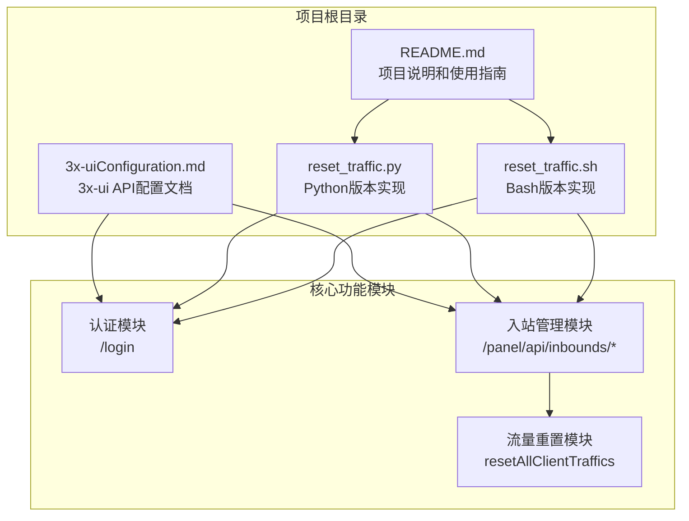
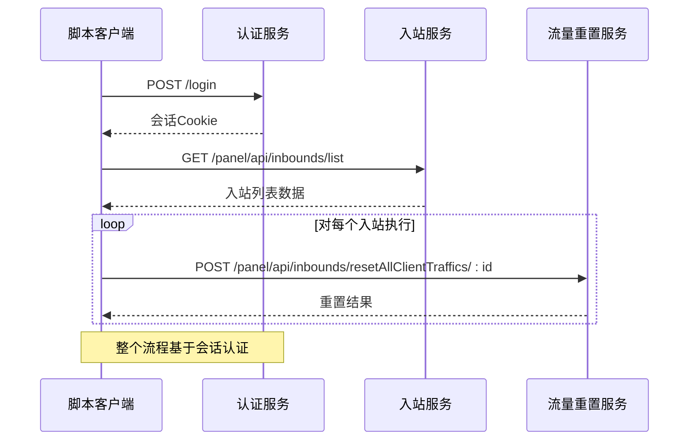
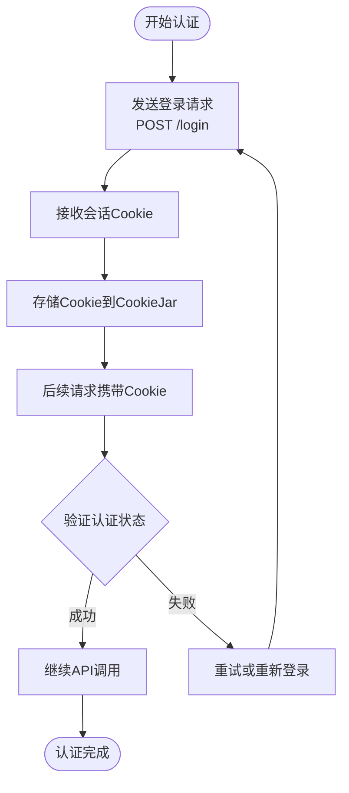
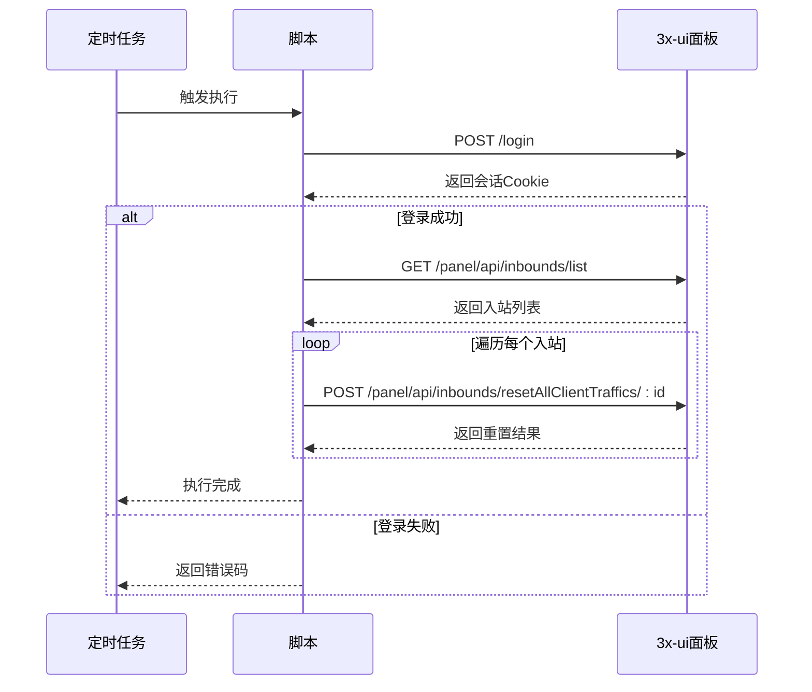
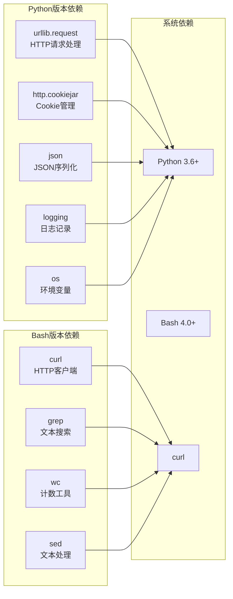
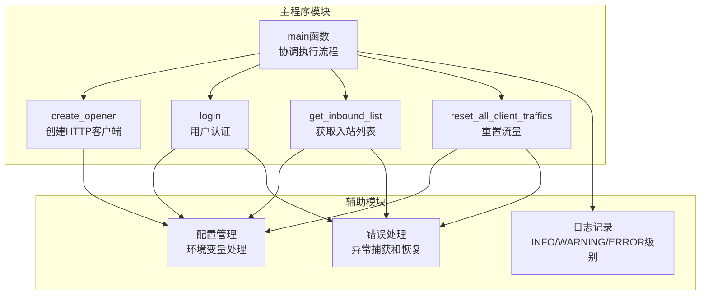

# API参考文档

<cite>
**本文档中引用的文件**
- [README.md](file://README.md)
- [3x-uiConfiguration.md](file://3x-uiConfiguration.md)
- [reset_traffic.py](file://reset_traffic.py)
- [reset_traffic.sh](file://reset_traffic.sh)
</cite>

## 目录
1. [简介](#简介)
2. [项目结构](#项目结构)
3. [核心组件](#核心组件)
4. [架构概览](#架构概览)
5. [详细组件分析](#详细组件分析)
6. [依赖关系分析](#依赖关系分析)
7. [性能考虑](#性能考虑)
8. [故障排除指南](#故障排除指南)
9. [结论](#结论)

## 简介

本文档提供了3x-ui面板API的详细参考文档，专注于脚本调用的三个核心API端点：`/login`、`/panel/api/inbounds/list`、`/panel/api/inbounds/resetAllClientTraffics/:id`。该脚本旨在自动重置所有入站(inbound)下所有客户端的已用流量（上传/下载归零），支持Python 3和Bash两种实现方式。

3x-ui是一个支持多协议多用户的Xray面板，支持多种传输协议包括VMess、VLESS、Trojan、Shadowsocks、Wireguard等。该面板提供了丰富的API接口用于自动化管理和监控。

## 项目结构

该项目采用简洁的结构设计，主要包含以下文件：



**图表来源**
- [README.md:16-23](file://README.md#L16-L23)
- [reset_traffic.py:14-28](file://reset_traffic.py#L14-L28)
- [reset_traffic.sh:14-18](file://reset_traffic.sh#L14-L18)

**章节来源**
- [README.md:16-23](file://README.md#L16-L23)
- [README.md:96-106](file://README.md#L96-L106)

## 核心组件

### 认证组件

认证组件负责用户身份验证和会话管理，是所有后续API调用的基础。

**章节来源**
- [reset_traffic.py:44-65](file://reset_traffic.py#L44-L65)
- [reset_traffic.sh:29-53](file://reset_traffic.sh#L29-L53)

### 入站管理组件

入站管理组件提供对系统中所有入站配置的查询和管理功能。

**章节来源**
- [reset_traffic.py:67-82](file://reset_traffic.py#L67-L82)
- [reset_traffic.sh:55-78](file://reset_traffic.sh#L55-L78)

### 流量重置组件

流量重置组件专门负责重置指定入站下所有客户端的流量统计信息。

**章节来源**
- [reset_traffic.py:85-98](file://reset_traffic.py#L85-L98)
- [reset_traffic.sh:88-108](file://reset_traffic.sh#L88-L108)

## 架构概览

整个系统采用客户端-服务器架构，脚本作为客户端向3x-ui面板服务器发起API请求。



**图表来源**
- [reset_traffic.py:101-134](file://reset_traffic.py#L101-L134)
- [reset_traffic.sh:27-115](file://reset_traffic.sh#L27-L115)

## 详细组件分析

### API端点规范

#### 1. 用户登录端点 - /login

**HTTP方法**: POST  
**URL模式**: `{PANEL_URL}/login`  
**内容类型**: application/json  
**请求参数**:

| 参数名 | 类型 | 必需 | 描述 |
|--------|------|------|------|
| username | string | 是 | 面板用户名 |
| password | string | 是 | 面板密码 |

**响应格式**:

```json
{
  "success": true,
  "msg": "登录成功",
  "obj": null
}
```

**状态码**:
- 200: 请求成功
- 401: 认证失败
- 500: 服务器内部错误

**章节来源**
- [3x-uiConfiguration.md:151-163](file://3x-uiConfiguration.md#L151-L163)
- [reset_traffic.py:44-65](file://reset_traffic.py#L44-L65)
- [reset_traffic.sh:29-53](file://reset_traffic.sh#L29-L53)

#### 2. 获取入站列表端点 - /panel/api/inbounds/list

**HTTP方法**: GET  
**URL模式**: `{PANEL_URL}/panel/api/inbounds/list`  
**认证**: 需要有效会话Cookie  
**请求参数**: 无  
**响应格式**:

```json
{
  "success": true,
  "msg": "操作成功",
  "obj": [
    {
      "id": 1,
      "remark": "VMess-TCP",
      "protocol": "vmess",
      "settings": {}
    },
    {
      "id": 2,
      "remark": "VLESS-WS",
      "protocol": "vless",
      "settings": {}
    }
  ]
}
```

**状态码**:
- 200: 请求成功
- 401: 未认证
- 500: 服务器内部错误

**章节来源**
- [3x-uiConfiguration.md:170-172](file://3x-uiConfiguration.md#L170-L172)
- [reset_traffic.py:67-82](file://reset_traffic.py#L67-L82)
- [reset_traffic.sh:55-78](file://reset_traffic.sh#L55-L78)

#### 3. 重置客户端流量端点 - /panel/api/inbounds/resetAllClientTraffics/:id

**HTTP方法**: POST  
**URL模式**: `{PANEL_URL}/panel/api/inbounds/resetAllClientTraffics/{id}`  
**认证**: 需要有效会话Cookie  
**路径参数**:
- id (必需): 入站ID

**请求参数**: 无  
**响应格式**:

```json
{
  "success": true,
  "msg": "操作成功",
  "obj": null
}
```

**状态码**:
- 200: 请求成功
- 401: 未认证
- 404: 入站不存在
- 500: 服务器内部错误

**章节来源**
- [3x-uiConfiguration.md:184-186](file://3x-uiConfiguration.md#L184-L186)
- [reset_traffic.py:85-98](file://reset_traffic.py#L85-L98)
- [reset_traffic.sh:88-108](file://reset_traffic.sh#L88-L108)

### 认证机制和会话管理

#### Cookie基础认证

脚本使用标准的Cookie基础认证机制：



**图表来源**
- [reset_traffic.py:38-42](file://reset_traffic.py#L38-L42)
- [reset_traffic.py:44-65](file://reset_traffic.py#L44-L65)
- [reset_traffic.sh:20-36](file://reset_traffic.sh#L20-L36)

#### 会话生命周期

1. **初始化**: 创建CookieJar实例
2. **认证**: 发送登录请求获取会话Cookie
3. **持久化**: 将Cookie存储在CookieJar中
4. **使用**: 后续API调用自动携带Cookie
5. **清理**: 脚本执行完毕后自动清理临时文件

**章节来源**
- [reset_traffic.py:38-42](file://reset_traffic.py#L38-L42)
- [reset_traffic.sh:20-21](file://reset_traffic.sh#L20-L21)

### API调用流程

#### 完整执行流程



**图表来源**
- [reset_traffic.py:101-134](file://reset_traffic.py#L101-L134)
- [reset_traffic.sh:27-115](file://reset_traffic.sh#L27-L115)

**章节来源**
- [reset_traffic.py:101-134](file://reset_traffic.py#L101-L134)
- [reset_traffic.sh:27-115](file://reset_traffic.sh#L27-L115)

### 错误处理机制

#### 错误分类和处理策略

| 错误类型 | HTTP状态码 | 错误原因 | 处理策略 |
|----------|------------|----------|----------|
| 网络连接错误 | URLError | 无法连接面板服务器 | 重试机制，记录详细错误信息 |
| 认证失败 | 401 | 用户名或密码错误 | 终止执行，返回非零退出码 |
| 资源不存在 | 404 | 入站ID不存在 | 跳过该入站，继续处理其他入站 |
| 服务器错误 | 500 | 服务器内部错误 | 重试或终止执行 |
| 超时错误 | Timeout | 请求超时 | 重试最多3次，超时则记录错误 |

**章节来源**
- [reset_traffic.py:62-64](file://reset_traffic.py#L62-L64)
- [reset_traffic.py:80-82](file://reset_traffic.py#L80-L82)
- [reset_traffic.py:96-98](file://reset_traffic.py#L96-L98)

## 依赖关系分析

### 外部依赖



**图表来源**
- [reset_traffic.py:14-22](file://reset_traffic.py#L14-L22)
- [reset_traffic.sh:1-12](file://reset_traffic.sh#L1-L12)

### 内部模块依赖



**图表来源**
- [reset_traffic.py:101-134](file://reset_traffic.py#L101-L134)
- [reset_traffic.py:38-42](file://reset_traffic.py#L38-L42)

**章节来源**
- [reset_traffic.py:14-22](file://reset_traffic.py#L14-L22)
- [reset_traffic.py:101-134](file://reset_traffic.py#L101-L134)

## 性能考虑

### 并发处理策略

当前实现采用串行处理方式，每个入站依次处理，这种设计的优势在于：

1. **资源友好**: 避免同时大量并发请求导致服务器压力
2. **可靠性高**: 单个入站失败不会影响其他入站的处理
3. **易于调试**: 错误定位和问题排查更加简单

### 超时和重试机制

- **连接超时**: 10秒
- **请求超时**: 30秒
- **重试次数**: 最多重试3次
- **超时处理**: 超时后记录错误并继续处理下一个入站

### 内存使用优化

- **Cookie持久化**: 使用临时文件存储Cookie，避免内存泄漏
- **流式处理**: 对于大型响应采用流式读取方式
- **及时清理**: 脚本执行完毕后自动清理临时文件

## 故障排除指南

### 常见问题诊断

#### 1. 认证失败

**症状**: 登录请求返回401状态码或认证失败消息

**可能原因**:
- 用户名或密码错误
- 面板URL配置错误
- 网络连接问题

**解决方案**:
- 验证用户名和密码正确性
- 检查面板URL是否包含协议(http/https)和端口号
- 确认网络连通性和防火墙设置

#### 2. 入站列表为空

**症状**: 获取入站列表时返回空数组

**可能原因**:
- 系统中没有配置任何入站
- 权限不足无法查看入站信息
- 面板数据库损坏

**解决方案**:
- 在面板中确认入站配置
- 检查用户权限设置
- 重启面板服务

#### 3. 流量重置失败

**症状**: 重置特定入站的流量时返回失败

**可能原因**:
- 入站ID不存在
- 入站处于禁用状态
- 服务器内部错误

**解决方案**:
- 验证入站ID的有效性
- 检查入站状态和配置
- 查看面板日志获取详细错误信息

### 调试技巧

#### 启用详细日志

```bash
# 设置环境变量启用详细日志
export XUI_DEBUG=true
python3 reset_traffic.py
```

#### 手动测试API端点

使用curl命令手动测试各个API端点：

```bash
# 测试登录端点
curl -X POST "${PANEL_URL}/login" \
  -H "Content-Type: application/json" \
  -d '{"username":"admin","password":"your_password"}'

# 测试获取入站列表
curl -X GET "${PANEL_URL}/panel/api/inbounds/list" \
  -H "Cookie: session_cookie_value"

# 测试重置流量
curl -X POST "${PANEL_URL}/panel/api/inbounds/resetAllClientTraffics/1" \
  -H "Cookie: session_cookie_value"
```

**章节来源**
- [reset_traffic.py:104-105](file://reset_traffic.py#L104-L105)
- [reset_traffic.py:129-131](file://reset_traffic.py#L129-L131)
- [reset_traffic.sh:41-51](file://reset_traffic.sh#L41-L51)

## 结论

本文档详细介绍了3x-ui面板API的核心功能，特别是针对流量重置场景的三个关键API端点。通过Python和Bash两种实现方式，用户可以根据自己的需求选择合适的脚本版本。

该脚本的主要优势包括：
- **可靠性**: 完善的错误处理和重试机制
- **易用性**: 支持环境变量配置和直接修改配置
- **自动化**: 适合与cron定时任务集成
- **透明度**: 详细的日志输出便于问题排查

对于生产环境使用，建议：
1. 使用HTTPS协议确保通信安全
2. 定期检查脚本执行日志
3. 设置适当的监控告警
4. 备份重要配置和数据
5. 定期更新脚本以适配面板版本升级