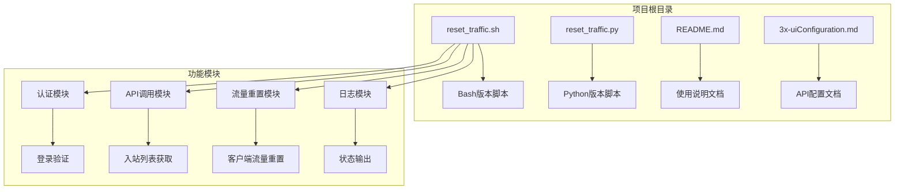
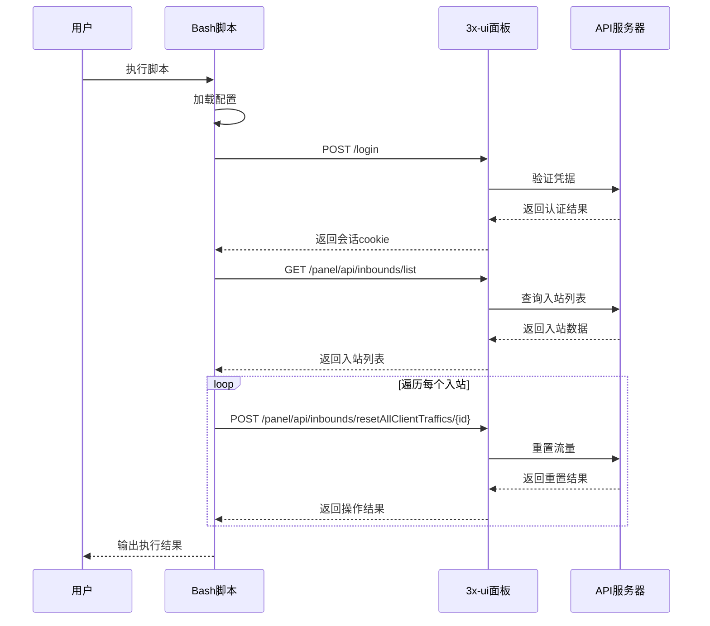
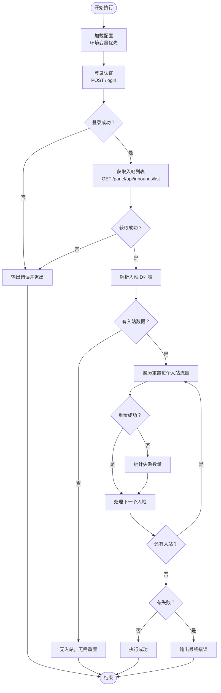
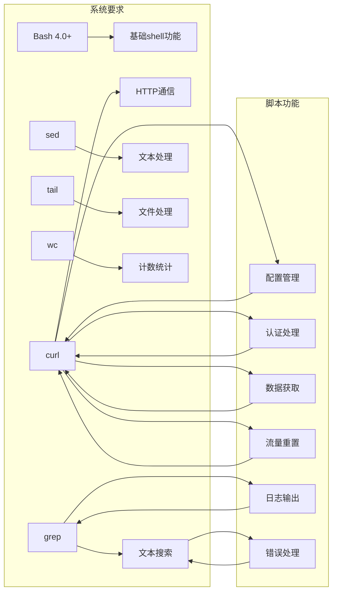
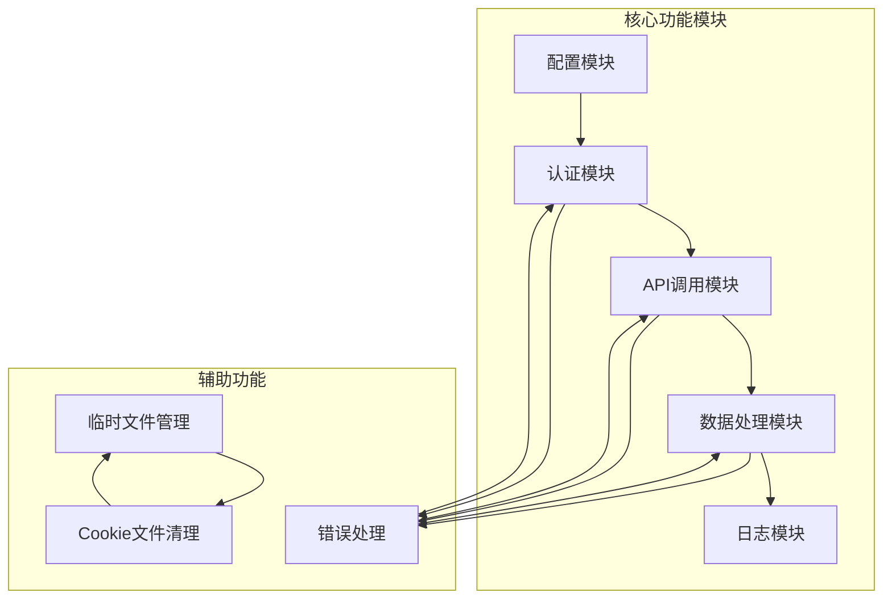
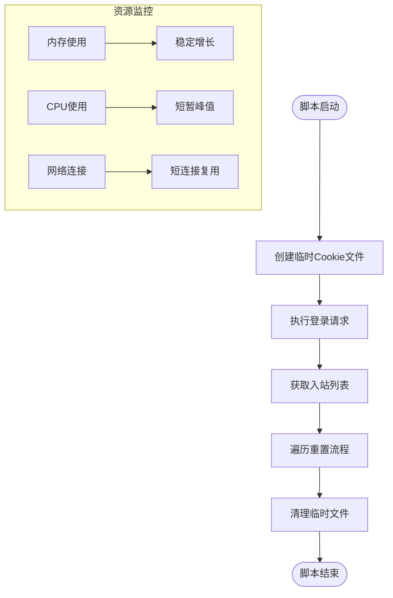

# Bash版本使用方法

<cite>
**本文档引用的文件**
- [README.md](file://README.md)
- [3x-uiConfiguration.md](file://3x-uiConfiguration.md)
- [reset_traffic.sh](file://reset_traffic.sh)
- [reset_traffic.py](file://reset_traffic.py)
</cite>

## 目录
1. [简介](#简介)
2. [项目结构](#项目结构)
3. [核心组件](#核心组件)
4. [架构概览](#架构概览)
5. [详细组件分析](#详细组件分析)
6. [依赖关系分析](#依赖关系分析)
7. [性能考虑](#性能考虑)
8. [故障排除指南](#故障排除指南)
9. [结论](#结论)
10. [附录](#附录)

## 简介

Bash版本3x-ui流量重置工具是一个专门设计用于自动化重置3x-ui面板中所有入站客户端流量的脚本工具。该工具通过调用3x-ui面板API，自动将所有入站下的客户端已用流量（上传/下载）归零，同时保持流量上限不变。

### 主要特点

- **轻量级设计**：仅依赖系统curl工具，无需额外Python依赖
- **简洁高效**：Bash脚本语法简单，执行速度快
- **环境变量支持**：支持通过环境变量配置面板参数
- **错误处理完善**：包含完整的HTTP状态码检查和错误消息解析
- **日志记录**：提供详细的执行日志输出
- **定时任务友好**：专为cron定时执行优化

## 项目结构

该项目采用简洁的文件组织结构，包含两个主要脚本文件和相关文档：



**图表来源**
- [reset_traffic.sh:1-116](file://reset_traffic.sh#L1-L116)
- [reset_traffic.py:1-139](file://reset_traffic.py#L1-L139)

**章节来源**
- [README.md:16-23](file://README.md#L16-L23)
- [reset_traffic.sh:14-18](file://reset_traffic.sh#L14-L18)

## 核心组件

### 配置管理组件

Bash版本采用环境变量优先的配置策略，提供了灵活的配置方式：

#### 环境变量配置
- `XUI_PANEL_URL`：3x-ui面板访问地址，默认值为`http://127.0.0.1:2053`
- `XUI_USERNAME`：面板用户名，默认值为`admin`
- `XUI_PASSWORD`：面板密码，默认值为`admin`

#### 配置优先级
1. 命令行环境变量（最高优先级）
2. 脚本内预设默认值（最低优先级）

**章节来源**
- [reset_traffic.sh:15-17](file://reset_traffic.sh#L15-L17)
- [README.md:28-52](file://README.md#L28-L52)

### HTTP通信组件

脚本使用curl工具进行HTTP通信，实现了完整的RESTful API交互流程：

#### 认证流程
1. 发送POST请求到`/login`端点
2. 解析响应JSON数据
3. 验证登录成功状态
4. 存储会话cookie用于后续请求

#### 数据获取流程
1. 请求`/panel/api/inbounds/list`获取入站列表
2. 解析返回的JSON数据
3. 提取所有入站ID列表

#### 数据操作流程
1. 对每个入站ID发送POST请求到`/panel/api/inbounds/resetAllClientTraffics/{id}`
2. 验证重置操作结果
3. 统计失败数量

**章节来源**
- [reset_traffic.sh:29-53](file://reset_traffic.sh#L29-L53)
- [reset_traffic.sh:55-75](file://reset_traffic.sh#L55-L75)
- [reset_traffic.sh:88-108](file://reset_traffic.sh#L88-L108)

## 架构概览

### 整体架构设计



**图表来源**
- [reset_traffic.sh:29-53](file://reset_traffic.sh#L29-L53)
- [reset_traffic.sh:55-75](file://reset_traffic.sh#L55-L75)
- [reset_traffic.sh:88-108](file://reset_traffic.sh#L88-L108)

### 数据流架构



**图表来源**
- [reset_traffic.sh:29-116](file://reset_traffic.sh#L29-L116)

## 详细组件分析

### 配置管理系统

#### 环境变量处理机制

脚本使用shell的参数扩展语法实现智能配置：

```bash
PANEL_URL="${XUI_PANEL_URL:-http://127.0.0.1:2053}"
USERNAME="${XUI_USERNAME:-admin}"
PASSWORD="${XUI_PASSWORD:-admin}"
```

这种设计确保了：
- **灵活性**：支持通过环境变量动态配置
- **安全性**：避免在脚本中硬编码敏感信息
- **兼容性**：提供合理的默认值

#### 配置验证机制

脚本包含基本的配置验证逻辑：
- 检查HTTP响应状态码
- 验证JSON响应中的success字段
- 解析并显示具体的错误消息

**章节来源**
- [reset_traffic.sh:15-17](file://reset_traffic.sh#L15-L17)
- [reset_traffic.sh:41-51](file://reset_traffic.sh#L41-L51)

### HTTP通信实现

#### cURL命令详解

脚本使用精心配置的cURL命令来处理HTTP通信：

```bash
curl -s -w "\n%{http_code}" \
    -X POST "${PANEL_URL}/login" \
    -H "Content-Type: application/json" \
    -d "{\"username\":\"${USERNAME}\",\"password\":\"${PASSWORD}\"}" \
    -c "$COOKIE_FILE" \
    --connect-timeout 10 \
    --max-time 30
```

关键参数说明：
- `-s`：静默模式，不显示进度条
- `-w "\n%{http_code}"`：将HTTP状态码输出到单独行
- `-c "$COOKIE_FILE"`：保存会话cookie到临时文件
- `--connect-timeout 10`：连接超时10秒
- `--max-time 30`：总请求超时30秒

#### JSON数据处理

脚本使用多种shell工具处理JSON响应：

```bash
HTTP_CODE=$(echo "$LOGIN_RESP" | tail -1)
BODY=$(echo "$LOGIN_RESP" | sed '$d')
SUCCESS=$(echo "$BODY" | grep -o '"success":\s*true' || true)
IDS=$(echo "$BODY" | grep -o '"id":[0-9]*' | grep -o '[0-9]*')
```

**章节来源**
- [reset_traffic.sh:30-36](file://reset_traffic.sh#L30-L36)
- [reset_traffic.sh:38-49](file://reset_traffic.sh#L38-L49)
- [reset_traffic.sh:77-78](file://reset_traffic.sh#L77-L78)

### 错误处理机制

#### 多层次错误检查

脚本实现了完整的错误处理流程：

1. **网络层错误**：检查HTTP状态码是否为200
2. **业务层错误**：验证JSON响应中的success字段
3. **具体错误**：提取并显示面板返回的具体错误消息

#### 错误恢复策略

- 单个入站重置失败不会影响其他入站的处理
- 统计失败数量并在最后报告
- 适当的退出码便于外部监控

**章节来源**
- [reset_traffic.sh:41-51](file://reset_traffic.sh#L41-L51)
- [reset_traffic.sh:65-75](file://reset_traffic.sh#L65-L75)
- [reset_traffic.sh:101-113](file://reset_traffic.sh#L101-L113)

## 依赖关系分析

### 外部依赖

Bash版本的依赖关系非常简单：



**图表来源**
- [README.md:94](file://README.md#L94)
- [reset_traffic.sh:12](file://reset_traffic.sh#L12)

### 内部依赖关系

脚本内部的功能模块相互依赖关系：



**图表来源**
- [reset_traffic.sh:20-25](file://reset_traffic.sh#L20-L25)
- [reset_traffic.sh:29-116](file://reset_traffic.sh#L29-L116)

**章节来源**
- [README.md:91-94](file://README.md#L91-L94)
- [reset_traffic.sh:12](file://reset_traffic.sh#L12)

## 性能考虑

### 执行效率优化

Bash版本在性能方面具有以下优势：

1. **启动速度快**：无需Python解释器启动时间
2. **内存占用低**：单进程执行，内存开销最小化
3. **网络延迟优化**：每个API调用独立处理，避免阻塞

### 并发处理能力

脚本采用串行处理方式，确保：
- **数据一致性**：避免并发操作导致的数据竞争
- **错误隔离**：单个失败不影响其他操作
- **资源控制**：避免过度消耗系统资源

### 资源管理



**图表来源**
- [reset_traffic.sh:20-21](file://reset_traffic.sh#L20-L21)
- [reset_traffic.sh:110-116](file://reset_traffic.sh#L110-L116)

## 故障排除指南

### 常见问题及解决方案

#### 1. 认证失败

**症状**：登录后返回错误消息
**可能原因**：
- 用户名或密码错误
- 面板地址配置错误
- 网络连接问题

**解决方法**：
```bash
# 验证面板连接
curl -I "http://127.0.0.1:2053/login"

# 检查凭据
echo "用户名: $XUI_USERNAME"
echo "密码: $XUI_PASSWORD"
```

#### 2. API调用失败

**症状**：获取入站列表或重置流量时报错
**可能原因**：
- 面板API不可用
- 网络防火墙阻止
- 会话过期

**解决方法**：
```bash
# 检查API可用性
curl -s "http://127.0.0.1:2053/panel/api/inbounds/list"

# 查看详细错误
curl -v "http://127.0.0.1:2053/panel/api/inbounds/list"
```

#### 3. 权限问题

**症状**：脚本执行权限不足
**解决方法**：
```bash
chmod +x reset_traffic.sh
./reset_traffic.sh
```

#### 4. 环境变量未生效

**症状**：脚本使用默认配置而非环境变量
**解决方法**：
```bash
# 设置环境变量
export XUI_PANEL_URL="http://127.0.0.1:2053"
export XUI_USERNAME="admin"
export XUI_PASSWORD="your_password"

# 验证设置
env | grep XUI_
```

### 调试技巧

#### 启用详细日志

```bash
# 在脚本中添加调试输出
set -x  # 启用命令跟踪
./reset_traffic.sh
set +x  # 禁用命令跟踪
```

#### 检查网络连接

```bash
# 测试网络连通性
ping 127.0.0.1
telnet 127.0.0.1 2053

# 检查防火墙设置
sudo iptables -L
```

**章节来源**
- [reset_traffic.sh:41-51](file://reset_traffic.sh#L41-L51)
- [reset_traffic.sh:65-75](file://reset_traffic.sh#L65-L75)
- [reset_traffic.sh:101-113](file://reset_traffic.sh#L101-L113)

## 结论

Bash版本3x-ui流量重置工具是一个设计精良的自动化脚本，具有以下显著优势：

### 技术优势

1. **简洁性**：仅依赖系统curl工具，部署简单
2. **可靠性**：完善的错误处理和超时控制
3. **可维护性**：清晰的代码结构和注释
4. **兼容性**：支持多种Linux发行版

### 使用建议

- **生产环境**：建议使用环境变量配置，避免硬编码敏感信息
- **监控设置**：结合cron定时任务，定期执行流量重置
- **日志管理**：配置适当的日志轮转，避免磁盘空间不足
- **安全考虑**：限制脚本执行权限，定期更新凭据

### 适用场景

- **个人用户**：简单的流量管理需求
- **小型团队**：不需要复杂功能的场景
- **资源受限环境**：对系统资源要求较低的环境

## 附录

### 完整使用示例

#### 基本执行方式

```bash
# 直接运行脚本
bash reset_traffic.sh

# 通过环境变量运行
XUI_PANEL_URL="http://127.0.0.1:2053" \
XUI_USERNAME="admin" \
XUI_PASSWORD="your_password" \
bash reset_traffic.sh
```

#### 定时任务配置

```bash
# 编辑crontab
crontab -e

# 添加每月1号执行的任务
0 2 1 * * \
XUI_PANEL_URL="http://127.0.0.1:2053" \
XUI_USERNAME="admin" \
XUI_PASSWORD="your_password" \
/path/to/reset_traffic.sh >> /var/log/3xui_reset.log 2>&1
```

### 与其他版本的对比

| 特性 | Bash版本 | Python版本 |
|------|----------|------------|
| 依赖要求 | 仅curl | Python 3.6+ |
| 安装复杂度 | 极简 | 中等 |
| 执行速度 | 快速 | 较慢 |
| 内存占用 | 低 | 中等 |
| 错误处理 | 基础 | 丰富 |
| 可读性 | 清晰 | 更强 |
| 维护成本 | 低 | 中等 |

### 最佳实践建议

1. **配置管理**：优先使用环境变量而非修改脚本
2. **安全存储**：使用系统密钥管理工具存储凭据
3. **监控告警**：设置执行结果监控和异常告警
4. **备份策略**：定期备份脚本和配置文件
5. **测试验证**：在生产环境部署前进行充分测试

**章节来源**
- [README.md:54-77](file://README.md#L54-L77)
- [reset_traffic.sh:5-10](file://reset_traffic.sh#L5-L10)