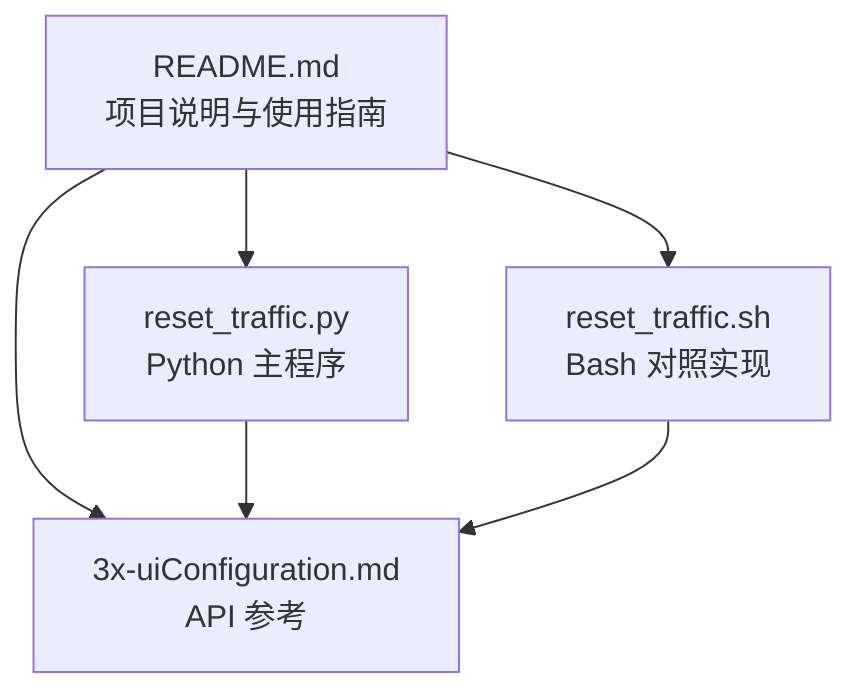
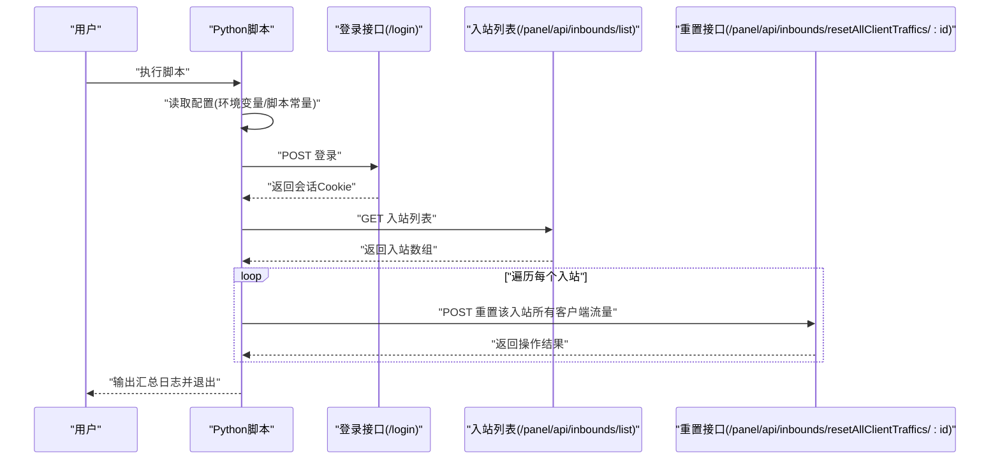
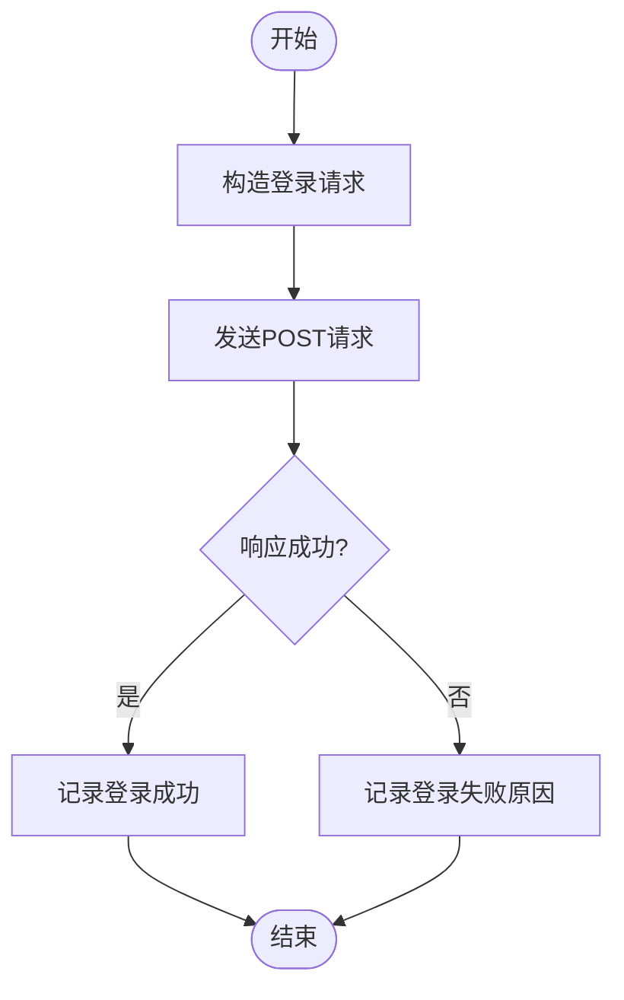
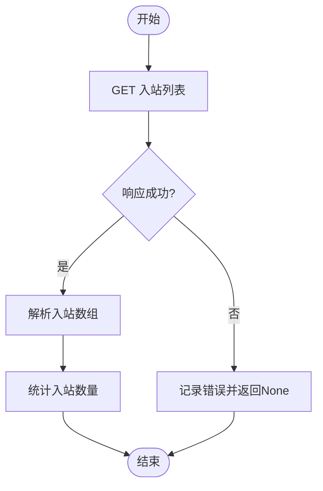
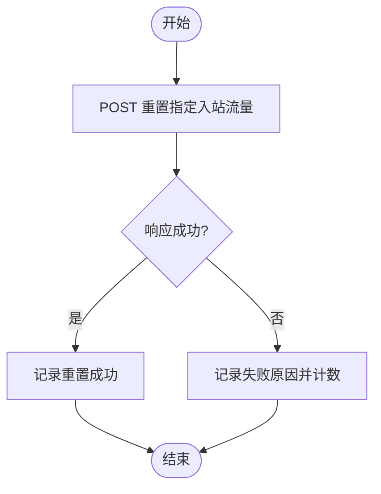
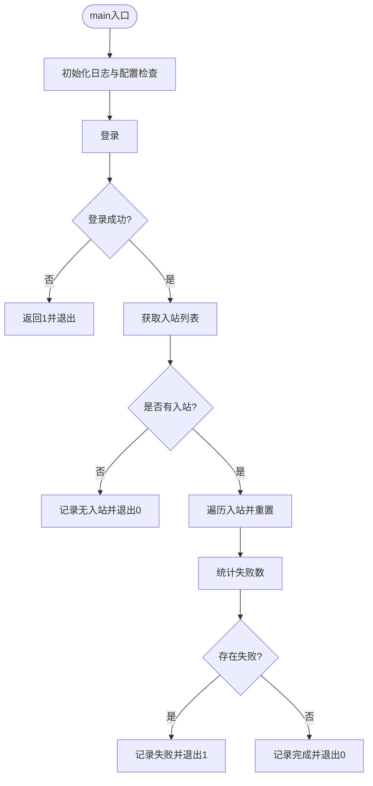
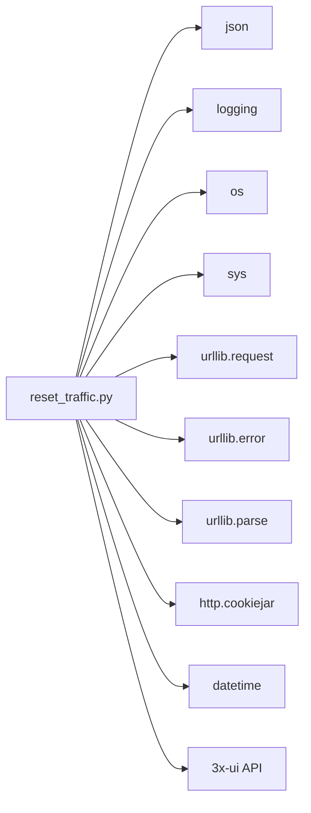

# Python版本使用方法

<cite>
**本文引用的文件**
- [README.md](file://README.md)
- [reset_traffic.py](file://reset_traffic.py)
- [reset_traffic.sh](file://reset_traffic.sh)
- [3x-uiConfiguration.md](file://3x-uiConfiguration.md)
</cite>

## 目录
1. [简介](#简介)
2. [项目结构](#项目结构)
3. [核心组件](#核心组件)
4. [架构总览](#架构总览)
5. [详细组件分析](#详细组件分析)
6. [依赖关系分析](#依赖关系分析)
7. [性能与可靠性考量](#性能与可靠性考量)
8. [故障排除指南](#故障排除指南)
9. [结论](#结论)
10. [附录](#附录)

## 简介
本文件面向使用 Python 版本 3x-ui 流量重置工具的用户，提供从安装、配置、执行到日志解读与故障排除的完整指南。Python 版本基于标准库实现，具备跨平台兼容性与良好的可维护性；同时提供 Bash 版本作为对比参考。脚本通过调用 3x-ui 面板 API，自动重置所有入站下所有客户端的已用流量（上传/下载归零），适合配合定时任务（如 cron）在每月初自动执行。

## 项目结构
仓库包含四个主要文件：
- README.md：项目说明、功能特性、使用方法、API 说明与许可证信息
- reset_traffic.py：Python 版本主程序，使用标准库进行网络请求与日志记录
- reset_traffic.sh：Bash 版本对照实现，便于理解与对比
- 3x-uiConfiguration.md：3x-ui API 文档与配置项参考

图表来源
- [README.md:1-129](file://README.md#L1-L129)
- [reset_traffic.py:1-139](file://reset_traffic.py#L1-L139)
- [reset_traffic.sh:1-116](file://reset_traffic.sh#L1-L116)
- [3x-uiConfiguration.md:147-229](file://3x-uiConfiguration.md#L147-L229)

章节来源
- [README.md:16-23](file://README.md#L16-L23)
- [reset_traffic.py:14-35](file://reset_traffic.py#L14-L35)
- [reset_traffic.sh:12-25](file://reset_traffic.sh#L12-L25)

## 核心组件
- 配置区域：通过环境变量或脚本内常量读取面板地址、用户名与密码
- 登录模块：向 /login 发送认证请求，获取会话 Cookie
- 入站列表模块：调用 /panel/api/inbounds/list 获取所有入站
- 流量重置模块：对每个入站调用 /panel/api/inbounds/resetAllClientTraffics/:id 重置其下所有客户端流量
- 日志模块：统一格式化输出，包含时间戳、级别与消息

章节来源
- [reset_traffic.py:24-28](file://reset_traffic.py#L24-L28)
- [reset_traffic.py:44-64](file://reset_traffic.py#L44-L64)
- [reset_traffic.py:67-82](file://reset_traffic.py#L67-L82)
- [reset_traffic.py:85-98](file://reset_traffic.py#L85-L98)
- [reset_traffic.py:30-35](file://reset_traffic.py#L30-L35)

## 架构总览
Python 脚本以模块化函数组织，遵循“配置-登录-查询-重置-汇总”的流程。整体交互通过 3x-ui 面板 API 完成，使用 HTTP Cookie 保持会话状态。

图表来源
- [reset_traffic.py:44-64](file://reset_traffic.py#L44-L64)
- [reset_traffic.py:67-82](file://reset_traffic.py#L67-L82)
- [reset_traffic.py:85-98](file://reset_traffic.py#L85-L98)
- [3x-uiConfiguration.md:151-162](file://3x-uiConfiguration.md#L151-L162)
- [3x-uiConfiguration.md:166-195](file://3x-uiConfiguration.md#L166-L195)

## 详细组件分析

### 配置区域与环境变量
- 面板地址：通过环境变量 XUI_PANEL_URL 读取，默认值为本地回环地址
- 用户名：通过 XUI_USERNAME 读取，默认 admin
- 密码：通过 XUI_PASSWORD 读取，默认 admin
- 建议优先使用环境变量注入，避免将敏感信息硬编码进脚本

章节来源
- [reset_traffic.py:24-28](file://reset_traffic.py#L24-L28)
- [README.md:28-52](file://README.md#L28-L52)

### 登录流程
- 请求路径：/login
- 方法：POST
- 内容类型：application/json
- 负载：包含用户名与密码
- 成功条件：响应中 success 字段为真
- 异常处理：捕获网络异常并记录错误

图表来源
- [reset_traffic.py:44-64](file://reset_traffic.py#L44-L64)

章节来源
- [reset_traffic.py:44-64](file://reset_traffic.py#L44-L64)
- [3x-uiConfiguration.md:151-162](file://3x-uiConfiguration.md#L151-L162)

### 获取入站列表
- 请求路径：/panel/api/inbounds/list
- 方法：GET
- 成功条件：响应中 success 字段为真
- 结果处理：提取入站数组长度用于后续循环

图表来源
- [reset_traffic.py:67-82](file://reset_traffic.py#L67-L82)

章节来源
- [reset_traffic.py:67-82](file://reset_traffic.py#L67-L82)
- [3x-uiConfiguration.md:166-173](file://3x-uiConfiguration.md#L166-L173)

### 重置单个入站流量
- 请求路径：/panel/api/inbounds/resetAllClientTraffics/:id
- 方法：POST
- 成功条件：响应中 success 字段为真
- 失败处理：记录具体错误消息并累计失败次数

图表来源
- [reset_traffic.py:85-98](file://reset_traffic.py#L85-L98)

章节来源
- [reset_traffic.py:85-98](file://reset_traffic.py#L85-L98)
- [3x-uiConfiguration.md:184-186](file://3x-uiConfiguration.md#L184-L186)

### 主流程与退出码
- 初始化日志与配置校验
- 登录、获取入站列表、逐个重置
- 统计失败数量并根据失败数决定退出码
- 输出开始/完成日志

图表来源
- [reset_traffic.py:101-135](file://reset_traffic.py#L101-L135)

章节来源
- [reset_traffic.py:101-135](file://reset_traffic.py#L101-L135)

## 依赖关系分析
- Python 版本依赖标准库：json、logging、os、sys、urllib.request、urllib.error、urllib.parse、http.cookiejar、datetime
- 与 3x-ui 面板 API 的耦合点明确：登录、入站列表、按入站重置流量
- 与 Bash 版本相比，Python 版本更易扩展与维护，且无需 shell 环境依赖

图表来源
- [reset_traffic.py:14-22](file://reset_traffic.py#L14-L22)
- [3x-uiConfiguration.md:151-195](file://3x-uiConfiguration.md#L151-L195)

章节来源
- [reset_traffic.py:14-22](file://reset_traffic.py#L14-L22)
- [README.md:91-94](file://README.md#L91-L94)

## 性能与可靠性考量
- 超时控制：各请求均设置超时，避免长时间阻塞
- 会话管理：使用 CookieJar 管理会话，确保后续请求携带会话信息
- 错误聚合：失败入站数量统计后统一输出，便于快速定位问题
- 日志粒度：INFO/ERROR 等级清晰，便于运维审计与问题排查

章节来源
- [reset_traffic.py:54-64](file://reset_traffic.py#L54-L64)
- [reset_traffic.py:71-82](file://reset_traffic.py#L71-L82)
- [reset_traffic.py:90-98](file://reset_traffic.py#L90-L98)

## 故障排除指南
常见问题与解决建议：
- 认证失败
  - 现象：登录阶段返回错误或 msg 字段提示失败
  - 排查：确认用户名/密码正确；检查面板是否启用登录；查看日志中的具体错误消息
  - 参考接口：/login
- 连接超时或无法访问面板
  - 现象：网络异常导致无法连接面板
  - 排查：确认 XUI_PANEL_URL 正确；检查防火墙与网络连通性；适当调整超时参数
  - 参考接口：/login、/panel/api/inbounds/list
- 获取入站列表失败
  - 现象：HTTP 状态码非 200 或 success 为假
  - 排查：确认会话有效；检查面板服务状态；查看返回的 msg
- 单个入站重置失败
  - 现象：某个入站重置返回失败
  - 排查：查看该入站 ID 与备注；检查面板对该入站的可用性；关注日志中的具体错误
- 默认配置风险
  - 现象：使用默认面板地址与凭证
  - 排查：通过环境变量注入真实配置；避免将默认值长期保留

章节来源
- [reset_traffic.py:44-64](file://reset_traffic.py#L44-L64)
- [reset_traffic.py:67-82](file://reset_traffic.py#L67-L82)
- [reset_traffic.py:85-98](file://reset_traffic.py#L85-L98)
- [reset_traffic.py:104-105](file://reset_traffic.py#L104-L105)
- [3x-uiConfiguration.md:151-162](file://3x-uiConfiguration.md#L151-L162)
- [3x-uiConfiguration.md:166-195](file://3x-uiConfiguration.md#L166-L195)

## 结论
Python 版本 3x-ui 流量重置工具以简洁的模块化设计实现了对 3x-ui 面板的自动化流量重置。通过环境变量注入配置、标准库网络请求与统一日志输出，既保证了可移植性，也便于集成到系统定时任务中。建议优先采用环境变量配置，结合日志与错误统计进行运维监控，确保每月流量重置的稳定性与可追溯性。

## 附录

### 使用方法与命令示例
- 直接运行 Python 版本
  - 示例：python3 reset_traffic.py
- 通过环境变量传参
  - 示例：XUI_PANEL_URL="http://IP:端口" XUI_USERNAME="用户名" XUI_PASSWORD="密码" python3 reset_traffic.py
- 配合 cron 定时执行
  - 示例：0 2 1 * * XUI_PANEL_URL="http://IP:端口" XUI_USERNAME="用户名" XUI_PASSWORD="密码" /usr/bin/python3 /path/to/reset_traffic.py >> /var/log/3xui_reset.log 2>&1

章节来源
- [README.md:54-77](file://README.md#L54-L77)

### 日志输出格式与含义
- 格式：YYYY-MM-DD HH:MM:SS [级别] 消息
- 示例：INFO 级别表示正常流程；ERROR 级别表示错误；WARNING 表示潜在风险（如使用默认配置）
- 关键节点：开始/结束标记、登录成功、入站数量、每个入站的重置结果、失败统计

章节来源
- [reset_traffic.py:30-35](file://reset_traffic.py#L30-L35)
- [README.md:79-89](file://README.md#L79-L89)

### Python 版本优势与适用场景
- 优势
  - 仅使用标准库，无需额外依赖
  - 跨平台兼容性好
  - 易于扩展与维护
- 适用场景
  - 需要稳定、可移植的自动化脚本
  - 已有 Python 环境或偏好使用 Python 的运维团队
  - 需要与现有 Python 工具链集成

章节来源
- [README.md:91-94](file://README.md#L91-L94)