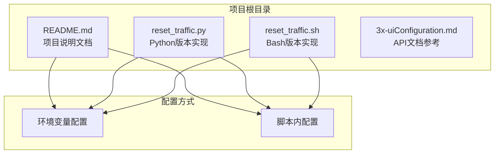
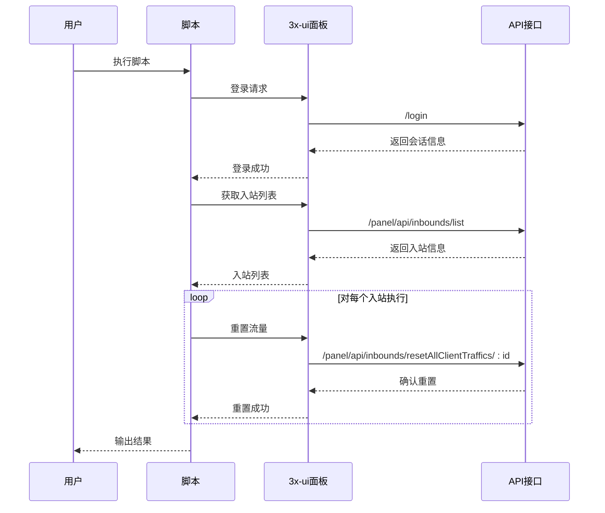
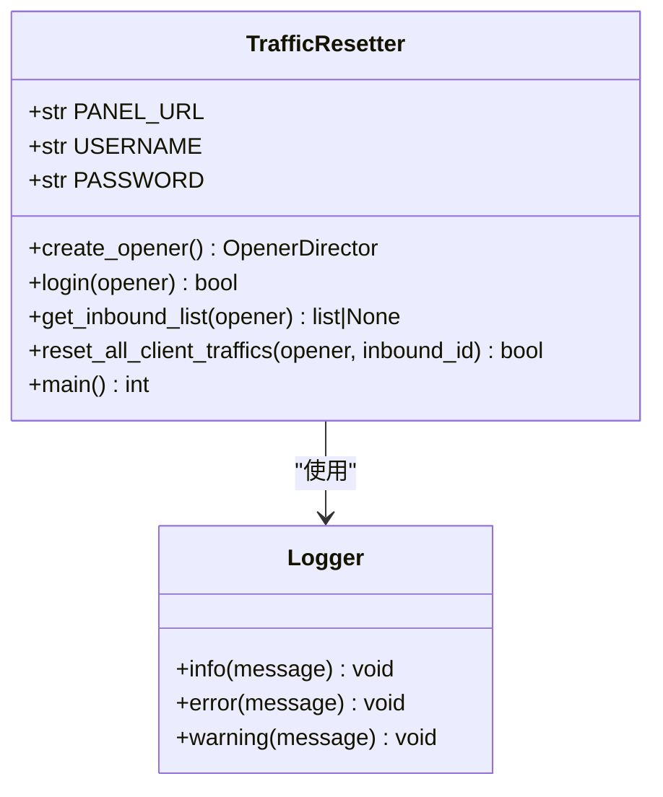
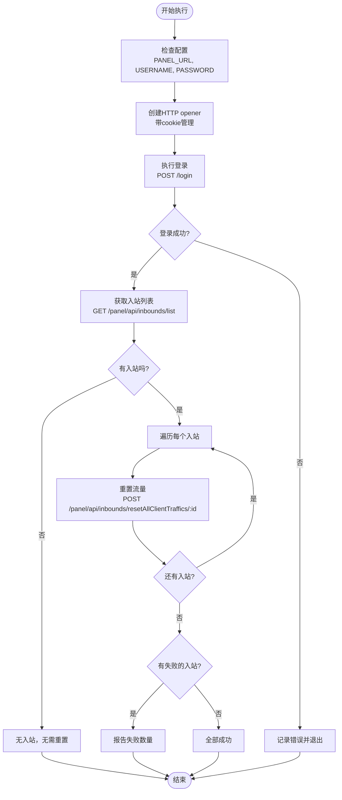
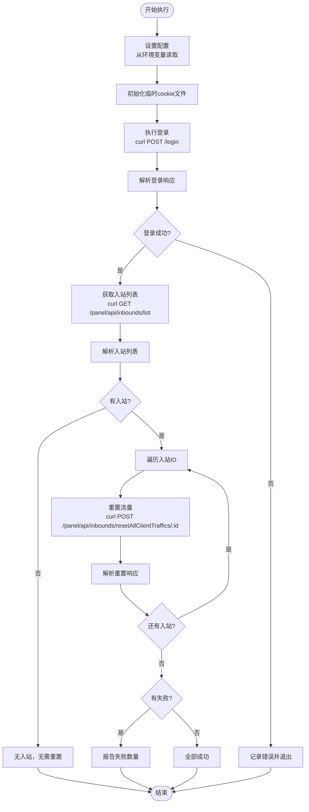
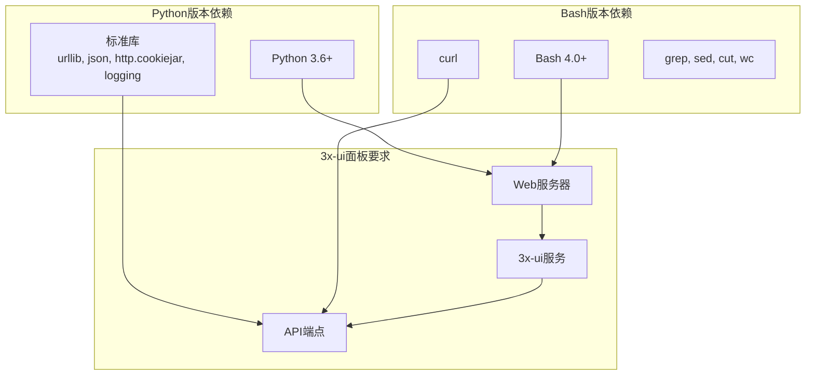
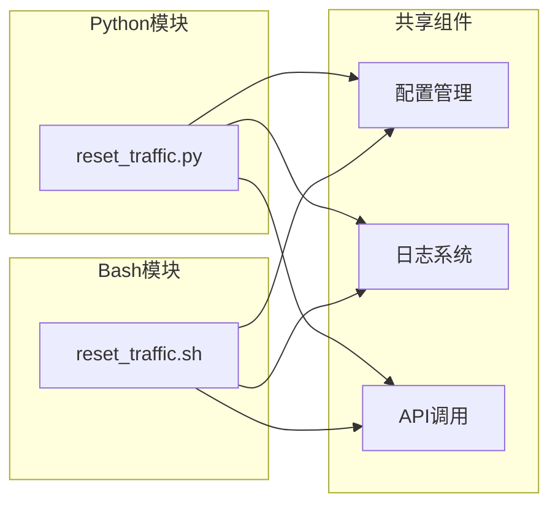

# 使用方法详解

<cite>
**本文引用的文件**
- [README.md](file://README.md)
- [reset_traffic.py](file://reset_traffic.py)
- [reset_traffic.sh](file://reset_traffic.sh)
- [3x-uiConfiguration.md](file://3x-uiConfiguration.md)
</cite>

## 目录
1. [简介](#简介)
2. [项目结构](#项目结构)
3. [核心组件](#核心组件)
4. [架构概览](#架构概览)
5. [详细组件分析](#详细组件分析)
6. [依赖关系分析](#依赖关系分析)
7. [性能考虑](#性能考虑)
8. [故障排除指南](#故障排除指南)
9. [结论](#结论)
10. [附录](#附录)

## 简介

3x-ui流量重置工具是一个自动化脚本，用于重置3x-ui面板中所有入站(inbound)下所有客户端的已用流量。该工具提供了Python 3和Bash两种实现方式，支持通过环境变量或直接修改脚本配置的方式进行部署，适合与cron定时任务配合使用，实现每月自动流量重置。

该工具的主要功能包括：
- 自动登录3x-ui面板并获取会话
- 遍历所有入站，批量重置客户端流量
- 详细的日志输出
- 支持环境变量配置
- 适合自动化部署

**章节来源**
- [README.md:1-15](file://README.md#L1-L15)

## 项目结构

该项目采用简洁的文件组织结构，包含一个README文档和两个主要脚本文件：



**图表来源**
- [README.md:16-23](file://README.md#L16-L23)

**章节来源**
- [README.md:16-23](file://README.md#L16-L23)

## 核心组件

### Python版本实现

Python版本使用标准库实现，具有以下特点：
- 使用urllib库进行HTTP请求
- 使用http.cookiejar管理会话cookie
- 使用logging模块进行日志记录
- 支持超时控制和异常处理
- 模块化设计，函数职责清晰

### Bash版本实现

Bash版本依赖curl进行HTTP通信，具有以下特点：
- 使用临时文件存储cookie信息
- 通过管道和正则表达式解析JSON响应
- 使用set -euo pipefail确保脚本健壮性
- 支持环境变量覆盖配置
- 脚本内嵌套函数实现模块化

### 配置管理

两种实现都支持两种配置方式：
1. **环境变量方式**：通过XUI_PANEL_URL、XUI_USERNAME、XUI_PASSWORD环境变量设置
2. **脚本内配置**：直接在脚本文件中修改配置变量

**章节来源**
- [reset_traffic.py:24-28](file://reset_traffic.py#L24-L28)
- [reset_traffic.sh:14-18](file://reset_traffic.sh#L14-L18)

## 架构概览

整个流量重置流程遵循统一的API调用模式：



**图表来源**
- [reset_traffic.py:44-98](file://reset_traffic.py#L44-L98)
- [reset_traffic.sh:29-108](file://reset_traffic.sh#L29-L108)

## 详细组件分析

### Python版本详细分析

#### 核心类和函数结构



**图表来源**
- [reset_traffic.py:38-139](file://reset_traffic.py#L38-L139)

#### 执行流程分析



**图表来源**
- [reset_traffic.py:101-135](file://reset_traffic.py#L101-L135)

#### 关键函数实现要点

**登录函数**：
- 使用POST方法向`/login`端点发送JSON数据
- 设置Content-Type为application/json
- 使用30秒超时限制
- 检查响应中的success字段

**获取入站列表函数**：
- 使用GET方法访问`/panel/api/inbounds/list`
- 解析JSON响应提取入站信息
- 记录获取到的入站数量

**重置流量函数**：
- 使用POST方法调用`/panel/api/inbounds/resetAllClientTraffics/:id`
- 对每个入站ID执行独立的重置操作
- 统计失败的入站数量

**章节来源**
- [reset_traffic.py:44-98](file://reset_traffic.py#L44-L98)

### Bash版本详细分析

#### 核心函数结构



**图表来源**
- [reset_traffic.sh:27-116](file://reset_traffic.sh#L27-L116)

#### 关键实现技术

**Cookie管理**：
- 使用mktemp创建临时文件存储cookie
- 使用trap确保脚本退出时清理临时文件
- 通过-c和-b参数在curl请求间传递cookie

**JSON解析**：
- 使用grep -o提取特定字段
- 使用sed删除最后一行(HTTP状态码)
- 使用cut提取具体消息内容

**错误处理**：
- 检查HTTP状态码是否为200
- 解析JSON中的success字段判断操作结果
- 提取msg字段获取详细错误信息

**章节来源**
- [reset_traffic.sh:20-25](file://reset_traffic.sh#L20-L25)

### 技术差异对比

| 特性 | Python版本 | Bash版本 |
|------|------------|----------|
| **依赖** | 标准库 | curl |
| **配置方式** | os.getenv() | ${VAR:-default} |
| **HTTP处理** | urllib库 | curl命令 |
| **JSON解析** | json库 | grep/sed/cut |
| **异常处理** | try/except | set -euxo pipefail |
| **日志格式** | logging模块 | echo + date |
| **超时控制** | timeout参数 | --connect-timeout/--max-time |
| **内存使用** | 较高 | 较低 |
| **可移植性** | 跨平台 | 依赖Unix环境 |

**章节来源**
- [reset_traffic.py:14-22](file://reset_traffic.py#L14-L22)
- [reset_traffic.sh:12](file://reset_traffic.sh#L12)

## 依赖关系分析

### 外部依赖



**图表来源**
- [README.md:91-94](file://README.md#L91-L94)

### 内部模块依赖



**图表来源**
- [reset_traffic.py:24-28](file://reset_traffic.py#L24-L28)
- [reset_traffic.sh:14-18](file://reset_traffic.sh#L14-L18)

**章节来源**
- [README.md:91-94](file://README.md#L91-L94)

## 性能考虑

### 时间复杂度分析

- **登录阶段**：O(1) - 单次API调用
- **获取入站列表**：O(n) - n为入站数量
- **重置流量**：O(n*m) - n为入站数量，m为每个入站的客户端数量
- **总体复杂度**：O(n*m)

### 内存使用

- **Python版本**：需要加载整个响应到内存，适合小到中等规模的部署
- **Bash版本**：逐行处理响应，内存占用较低，适合大规模部署

### 并发处理

两种实现都是串行执行，没有并发重置功能。对于大量入站的情况，建议：
1. 增加超时时间
2. 分批处理入站
3. 监控API响应时间

## 故障排除指南

### 常见问题及解决方案

#### 登录失败

**症状**：脚本报错"登录失败"或HTTP状态码非200
**可能原因**：
- 面板URL配置错误
- 用户名或密码错误
- 面板服务不可用
- 网络连接问题

**解决方法**：
1. 验证面板URL格式：`http://IP:端口`或`https://域名`
2. 检查用户名和密码是否正确
3. 确认面板服务正常运行
4. 测试网络连通性

#### API调用失败

**症状**：获取入站列表或重置流量时报错
**可能原因**：
- API端点路径错误
- 会话过期
- 权限不足
- 3x-ui版本不兼容

**解决方法**：
1. 验证API端点路径
2. 检查会话cookie是否正确传递
3. 确认用户权限
4. 查看3x-uiConfiguration.md确认API兼容性

#### 环境变量未生效

**症状**：脚本使用默认配置而非环境变量
**可能原因**：
- 环境变量名称错误
- 环境变量值为空
- shell环境问题

**解决方法**：
1. 验证环境变量名称：XUI_PANEL_URL, XUI_USERNAME, XUI_PASSWORD
2. 检查环境变量值是否正确设置
3. 在脚本中添加调试输出验证变量值

#### 超时问题

**症状**：脚本执行超时或响应缓慢
**可能原因**：
- 网络延迟过高
- 3x-ui负载过大
- API响应时间过长

**解决方法**：
1. 增加超时时间设置
2. 优化网络连接
3. 减少同时执行的脚本数量

**章节来源**
- [reset_traffic.py:62-64](file://reset_traffic.py#L62-L64)
- [reset_traffic.py:80-82](file://reset_traffic.py#L80-L82)
- [reset_traffic.py:96-98](file://reset_traffic.py#L96-L98)

## 结论

3x-ui流量重置工具提供了两种可靠的实现方式，各有优势：

**Python版本适合**：
- 需要复杂错误处理的场景
- 需要与其他Python工具集成
- 对代码可读性和维护性要求较高

**Bash版本适合**：
- 轻量级部署需求
- 已有shell脚本生态
- 对资源消耗敏感的环境

两种实现都提供了完整的功能集，包括自动登录、批量重置、详细日志和错误处理。选择哪种实现主要取决于部署环境和技术栈偏好。

## 附录

### 使用示例

#### Python版本使用示例

**环境变量方式**：
```bash
export XUI_PANEL_URL="http://127.0.0.1:2053"
export XUI_USERNAME="admin"
export XUI_PASSWORD="your_password"
python3 reset_traffic.py
```

**直接运行方式**：
```bash
python3 reset_traffic.py
```

#### Bash版本使用示例

**环境变量方式**：
```bash
export XUI_PANEL_URL="http://127.0.0.1:2053"
export XUI_USERNAME="admin"
export XUI_PASSWORD="your_password"
bash reset_traffic.sh
```

**直接运行方式**：
```bash
bash reset_traffic.sh
```

#### 定时执行配置

**Cron配置示例**：
```bash
# 每月1号凌晨2点执行
0 2 1 * * XUI_PANEL_URL="http://IP:端口" XUI_USERNAME="用户名" XUI_PASSWORD="密码" /usr/bin/python3 /path/to/reset_traffic.py >> /var/log/3xui_reset.log 2>&1

# 或使用Bash版本
0 2 1 * * XUI_PANEL_URL="http://IP:端口" XUI_USERNAME="用户名" XUI_PASSWORD="密码" /path/to/reset_traffic.sh >> /var/log/3xui_reset.log 2>&1
```

### 日志输出格式说明

**Python版本日志格式**：
```
YYYY-MM-DD HH:MM:SS [级别] 消息内容
```

**Bash版本日志格式**：
```
YYYY-MM-DD HH:MM:SS [级别] 消息内容
```

**日志级别含义**：
- `INFO`：普通信息和成功操作
- `ERROR`：错误信息
- `WARNING`：警告信息

**典型日志流程**：
1. 开始执行标记
2. 登录成功信息
3. 入站数量信息
4. 每个入站的重置结果
5. 总体执行结果

### 最佳实践建议

1. **安全配置**：
   - 使用环境变量而非硬编码密码
   - 限制脚本执行权限
   - 定期轮换面板密码

2. **监控和日志**：
   - 定期检查日志文件
   - 设置适当的日志轮转
   - 监控脚本执行时间

3. **备份策略**：
   - 执行前备份3x-ui数据库
   - 测试环境验证脚本功能
   - 制定回滚计划

4. **性能优化**：
   - 合理设置超时时间
   - 监控API响应时间
   - 避免在高峰期执行

5. **故障恢复**：
   - 实施重试机制
   - 设置告警通知
   - 准备人工干预方案

**章节来源**
- [README.md:24-77](file://README.md#L24-L77)
- [README.md:79-89](file://README.md#L79-L89)