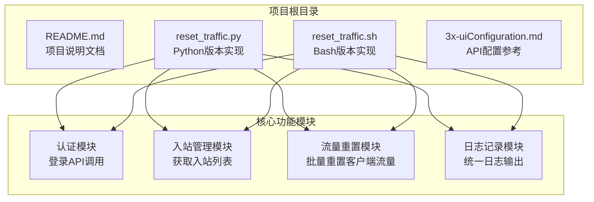
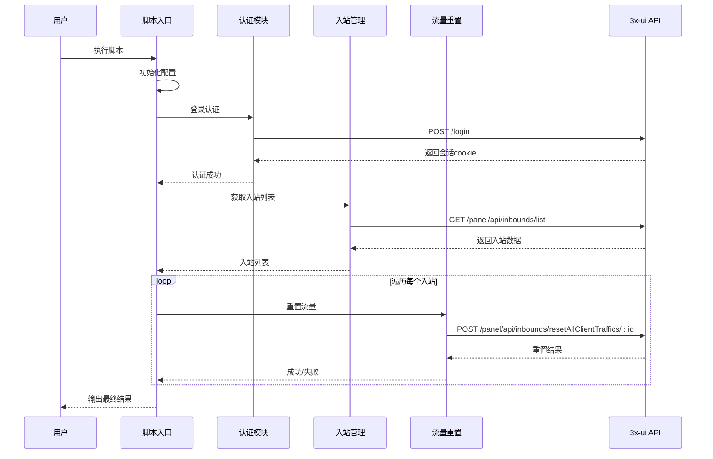
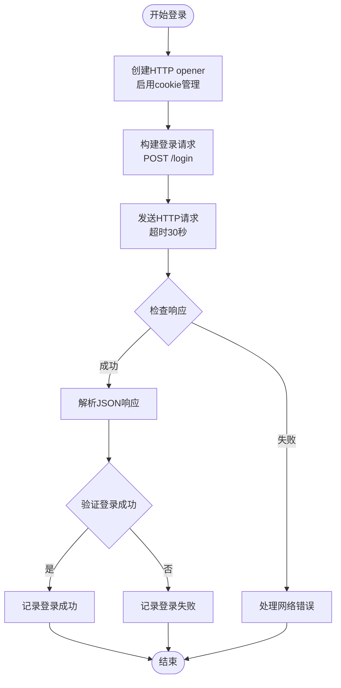
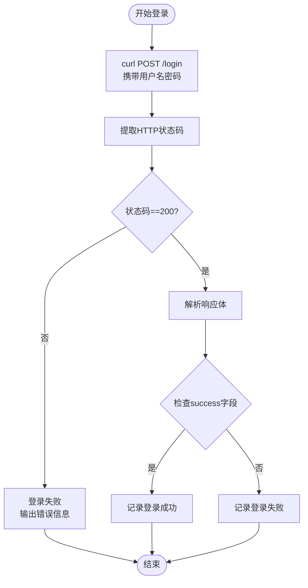
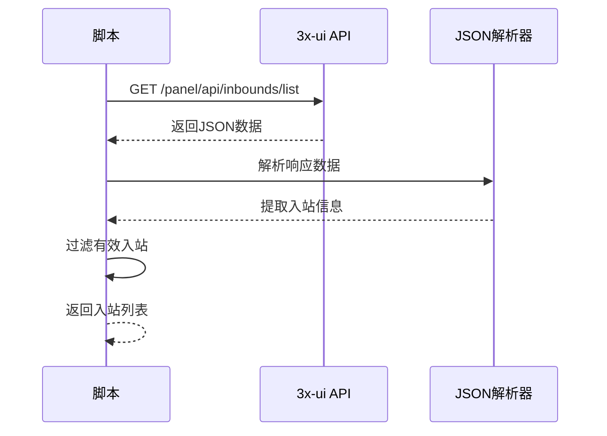
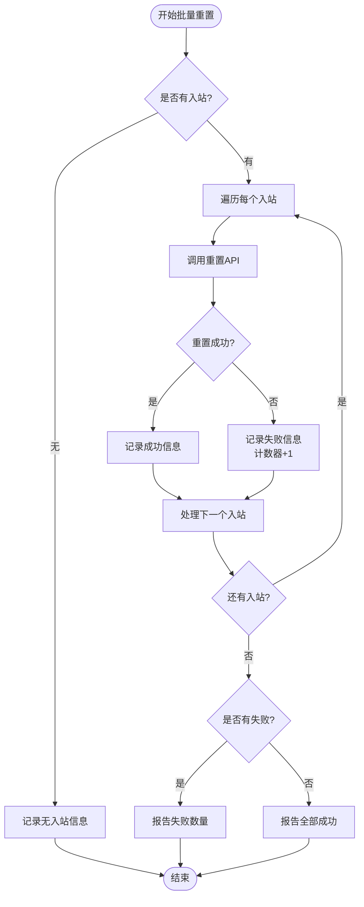
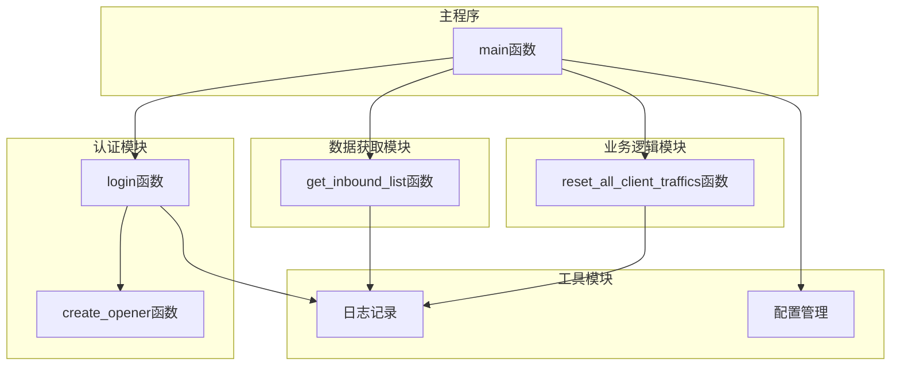
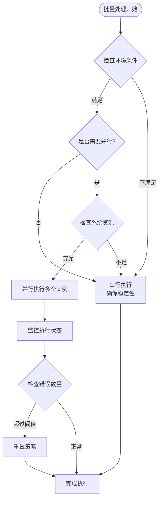
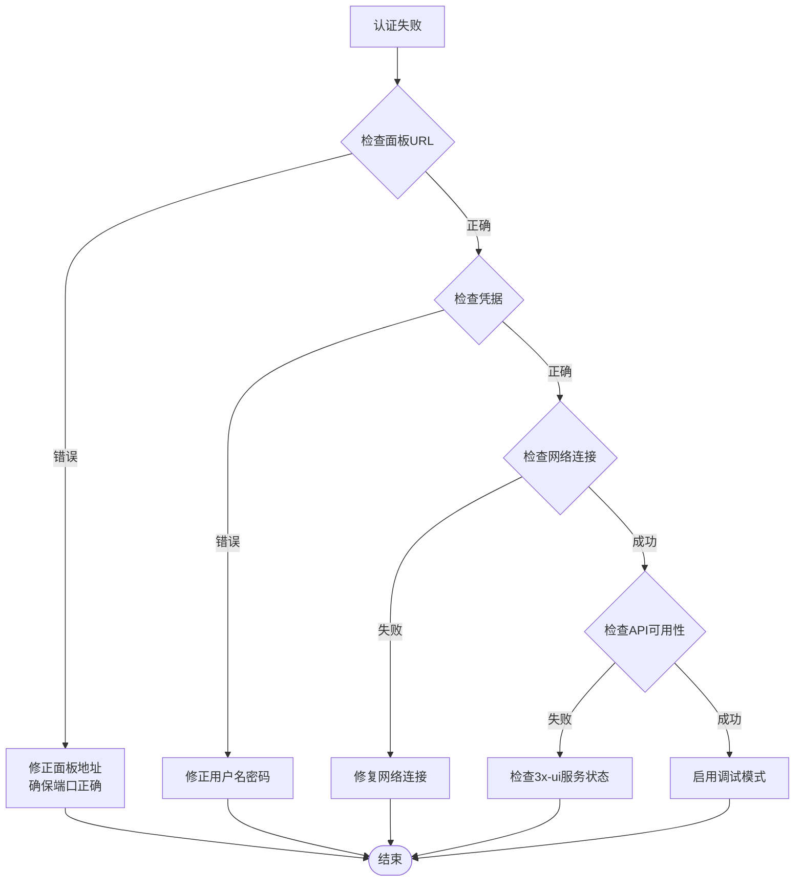
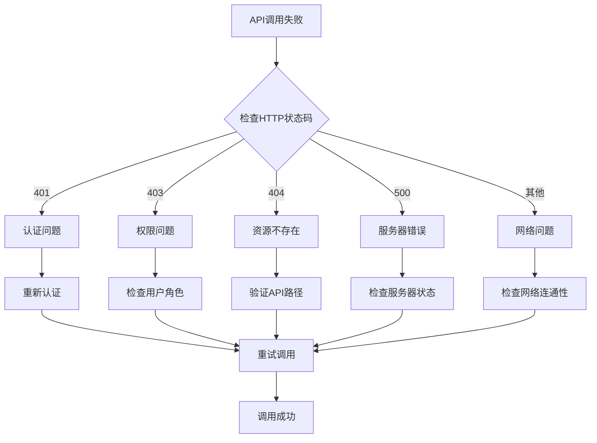

# 执行示例和场景

<cite>
**本文引用的文件**
- [README.md](file://README.md)
- [reset_traffic.py](file://reset_traffic.py)
- [reset_traffic.sh](file://reset_traffic.sh)
- [3x-uiConfiguration.md](file://3x-uiConfiguration.md)
</cite>

## 目录
1. [简介](#简介)
2. [项目结构](#项目结构)
3. [核心组件](#核心组件)
4. [架构概览](#架构概览)
5. [详细组件分析](#详细组件分析)
6. [依赖关系分析](#依赖关系分析)
7. [性能考虑](#性能考虑)
8. [故障排除指南](#故障排除指南)
9. [结论](#结论)
10. [附录](#附录)

## 简介

3x-ui流量重置工具是一个自动化脚本集合，专门设计用于通过调用3x-ui面板API来重置所有入站(inbound)下所有客户端的已用流量。该工具提供了Python 3和Bash两种实现方式，支持通过环境变量或直接修改脚本配置的方式进行部署。

该工具的核心功能包括：
- 自动登录并获取会话cookie
- 遍历所有入站，批量重置客户端流量
- 详细的日志输出
- 适合配合cron定时执行
- 支持多种部署场景

## 项目结构

该项目采用简洁的文件组织结构，主要包含四个核心文件：



**图表来源**
- [README.md:16-23](file://README.md#L16-L23)
- [reset_traffic.py:14-35](file://reset_traffic.py#L14-L35)
- [reset_traffic.sh:23-25](file://reset_traffic.sh#L23-L25)

**章节来源**
- [README.md:16-23](file://README.md#L16-L23)

## 核心组件

### Python版本实现

Python版本使用标准库实现，具有以下特点：
- 使用urllib.request进行HTTP通信
- 通过http.cookiejar管理会话状态
- 支持环境变量配置
- 结构化的函数式设计

### Bash版本实现

Bash版本依赖curl进行HTTP通信，具有以下特点：
- 使用临时文件存储cookie
- 通过管道和正则表达式解析JSON响应
- 错误处理和状态码检查
- 轻量级部署要求

### 配置管理系统

两个版本都支持两种配置方式：
1. **环境变量方式**（推荐）：通过XUI_PANEL_URL、XUI_USERNAME、XUI_PASSWORD环境变量
2. **脚本内配置**：直接修改脚本中的配置常量

**章节来源**
- [reset_traffic.py:24-28](file://reset_traffic.py#L24-L28)
- [reset_traffic.sh:14-18](file://reset_traffic.sh#L14-L18)

## 架构概览

该工具采用三层架构设计，实现了清晰的关注点分离：



**图表来源**
- [reset_traffic.py:44-98](file://reset_traffic.py#L44-L98)
- [reset_traffic.sh:29-108](file://reset_traffic.sh#L29-L108)

## 详细组件分析

### 认证模块分析

#### Python实现流程



**图表来源**
- [reset_traffic.py:38-64](file://reset_traffic.py#L38-L64)

#### Bash实现流程



**图表来源**
- [reset_traffic.sh:29-51](file://reset_traffic.sh#L29-L51)

**章节来源**
- [reset_traffic.py:44-64](file://reset_traffic.py#L44-L64)
- [reset_traffic.sh:29-51](file://reset_traffic.sh#L29-L51)

### 入站管理模块分析

#### 数据获取流程



**图表来源**
- [reset_traffic.py:67-82](file://reset_traffic.py#L67-L82)
- [reset_traffic.sh:55-75](file://reset_traffic.sh#L55-L75)

#### 入站类型识别

脚本能够自动识别不同类型的入站协议：
- VMess-TCP
- VLESS-WS  
- Trojan-gRPC
- 其他支持的协议类型

**章节来源**
- [reset_traffic.py:121-127](file://reset_traffic.py#L121-L127)
- [reset_traffic.sh:88-108](file://reset_traffic.sh#L88-L108)

### 流量重置模块分析

#### 批量重置流程



**图表来源**
- [reset_traffic.py:120-134](file://reset_traffic.py#L120-L134)
- [reset_traffic.sh:88-116](file://reset_traffic.sh#L88-L116)

**章节来源**
- [reset_traffic.py:85-98](file://reset_traffic.py#L85-L98)
- [reset_traffic.sh:88-108](file://reset_traffic.sh#L88-L108)

## 依赖关系分析

### 外部依赖

```mermaid
graph LR
subgraph "Python版本依赖"
A[Python 3.6+]
B[标准库:<br/>json, logging, os, sys,<br/>urllib.request, urllib.error,<br/>urllib.parse, http.cookiejar]
end
subgraph "Bash版本依赖"
C[Bash 4.0+]
D[curl]
E[mktemp]
F[grep, sed, tail, head, wc]
end
subgraph "3x-ui API依赖"
G[/login<br/>POST]
H[/panel/api/inbounds/list<br/>GET]
I[/panel/api/inbounds/resetAllClientTraffics/:id<br/>POST]
end
A --> G
C --> G
B --> H
D --> H
B --> I
D --> I
```

**图表来源**
- [README.md:91-94](file://README.md#L91-L94)
- [reset_traffic.py:14-22](file://reset_traffic.py#L14-L22)
- [reset_traffic.sh:12](file://reset_traffic.sh#L12)

### 内部模块依赖



**图表来源**
- [reset_traffic.py:38-138](file://reset_traffic.py#L38-L138)

**章节来源**
- [README.md:91-94](file://README.md#L91-L94)
- [reset_traffic.py:14-35](file://reset_traffic.py#L14-L35)

## 性能考虑

### 并发执行注意事项

由于脚本采用串行方式处理每个入站，存在以下性能特征：

1. **线性处理时间**：每个入站需要单独的API调用，总时间约为入站数量的线性函数
2. **网络延迟影响**：主要受网络延迟和3x-ui面板响应时间影响
3. **内存使用**：使用一次性内存分配，适合大多数部署环境

### 批量处理优化建议



**图表来源**
- [reset_traffic.py:120-134](file://reset_traffic.py#L120-L134)

### 资源使用分析

- **CPU使用率**：低至中等，主要在JSON解析和字符串处理
- **内存占用**：小型脚本，通常小于10MB
- **网络带宽**：主要受API响应大小影响
- **磁盘I/O**：主要用于日志文件写入

## 故障排除指南

### 常见问题诊断

#### 认证失败排查



#### API调用失败排查



**图表来源**
- [reset_traffic.py:54-64](file://reset_traffic.py#L54-L64)
- [reset_traffic.sh:41-51](file://reset_traffic.sh#L41-L51)

### 日志分析方法

#### 日志格式规范

脚本提供统一的日志格式，便于自动化分析：

| 时间戳 | 日志级别 | 消息内容 |
|--------|----------|----------|
| 2025-01-01 02:00:00 | INFO | ===== 3x-ui Client 流量重置 开始 [2025-01-01] ===== |
| 2025-01-01 02:00:01 | INFO | 登录成功 |
| 2025-01-01 02:00:01 | INFO | 获取到 3 个 inbound |
| 2025-01-01 02:00:02 | INFO | inbound 1 (VMess-TCP) 的所有 client 流量已重置 |

#### 结果验证步骤

1. **检查执行时间**：确认脚本在预期时间执行
2. **验证日志完整性**：确保开始和结束标记都存在
3. **检查入站数量**：确认获取到的入站数量与预期一致
4. **验证重置结果**：确认所有入站都显示重置成功
5. **监控错误计数**：确保失败计数为0

**章节来源**
- [README.md:79-89](file://README.md#L79-L89)
- [reset_traffic.py:101-134](file://reset_traffic.py#L101-L134)
- [reset_traffic.sh:27-116](file://reset_traffic.sh#L27-L116)

## 结论

3x-ui流量重置工具提供了可靠、高效的自动化解决方案，适用于各种部署场景。其设计特点包括：

1. **双语言支持**：Python和Bash版本满足不同技术栈需求
2. **灵活配置**：支持环境变量和脚本内配置两种方式
3. **健壮性设计**：完善的错误处理和日志记录机制
4. **易于集成**：支持cron定时执行，便于自动化部署

该工具特别适合需要定期重置流量的场景，如测试环境、生产环境的流量管理等。通过合理的配置和监控，可以确保流量重置操作的稳定性和可靠性。

## 附录

### 执行示例

#### Python版本一次性重置

```bash
# 设置环境变量
export XUI_PANEL_URL="http://127.0.0.1:2053"
export XUI_USERNAME="admin"
export XUI_PASSWORD="your_password"

# 执行脚本
python3 reset_traffic.py
```

#### Bash版本一次性重置

```bash
# 设置环境变量
export XUI_PANEL_URL="http://127.0.0.1:2053"
export XUI_USERNAME="admin"
export XUI_PASSWORD="your_password"

# 执行脚本
bash reset_traffic.sh
```

### 定时任务配置

#### Cron配置示例

```bash
# 每月1号凌晨2点执行
0 2 1 * * XUI_PANEL_URL="http://IP:端口" XUI_USERNAME="用户名" XUI_PASSWORD="密码" /usr/bin/python3 /path/to/reset_traffic.py >> /var/log/3xui_reset.log 2>&1

# 或使用Bash版本
0 2 1 * * XUI_PANEL_URL="http://IP:端口" XUI_USERNAME="用户名" XUI_PASSWORD="密码" /path/to/reset_traffic.sh >> /var/log/3xui_reset.log 2>&1
```

#### 不同时间调度规则

| 调度规则 | 执行频率 | 适用场景 |
|----------|----------|----------|
| `0 2 1 * *` | 每月1号凌晨2点 | 月度流量重置 |
| `0 0 * * 0` | 每周日凌晨0点 | 周度流量重置 |
| `0 0 15 * *` | 每月15号凌晨0点 | 半月度流量重置 |
| `*/30 * * * *` | 每30分钟 | 实时监控和重置 |

### 使用场景示例

#### 测试环境配置

```bash
# 测试环境专用配置
export XUI_PANEL_URL="http://test-panel:2053"
export XUI_USERNAME="test_user"
export XUI_PASSWORD="test_password"

# 更频繁的执行间隔
*/10 * * * * /usr/bin/python3 /opt/3xui/reset_traffic.py >> /var/log/3xui_test_reset.log 2>&1
```

#### 生产环境配置

```bash
# 生产环境配置
export XUI_PANEL_URL="https://panel.example.com"
export XUI_USERNAME="prod_user"
export XUI_PASSWORD="prod_password"

# 安全的执行时间
0 3 1 * * /usr/bin/python3 /opt/3xui/reset_traffic.py >> /var/log/3xui_prod_reset.log 2>&1
```

#### 多面板管理

```bash
# 创建批处理脚本
#!/bin/bash
PANELS=(
    "http://panel1:2053:admin:password1"
    "http://panel2:2053:admin:password2"
    "http://panel3:2053:admin:password3"
)

for panel in "${PANELS[@]}"; do
    IFS=':' read -r url user pass <<< "$panel"
    XUI_PANEL_URL="$url" XUI_USERNAME="$user" XUI_PASSWORD="$pass" python3 reset_traffic.py &
done

wait
```

### 最佳实践建议

1. **安全配置**：使用环境变量而非硬编码密码
2. **监控设置**：配置适当的日志轮转和告警
3. **备份策略**：在执行前备份重要数据
4. **测试验证**：先在测试环境验证脚本功能
5. **错误处理**：实现适当的错误恢复机制
6. **性能优化**：对于大量入站，考虑分批处理策略

### API参考

#### 支持的API端点

| 端点 | 方法 | 描述 |
|------|------|------|
| `/login` | POST | 用户登录，获取会话 |
| `/panel/api/inbounds/list` | GET | 获取所有入站列表 |
| `/panel/api/inbounds/resetAllClientTraffics/:id` | POST | 重置指定入站下所有客户端流量 |

**章节来源**
- [README.md:24-77](file://README.md#L24-L77)
- [3x-uiConfiguration.md:151-201](file://3x-uiConfiguration.md#L151-L201)