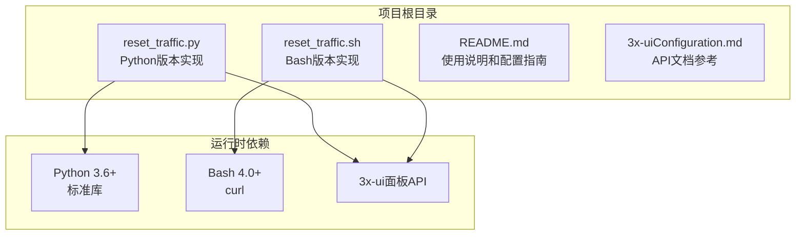
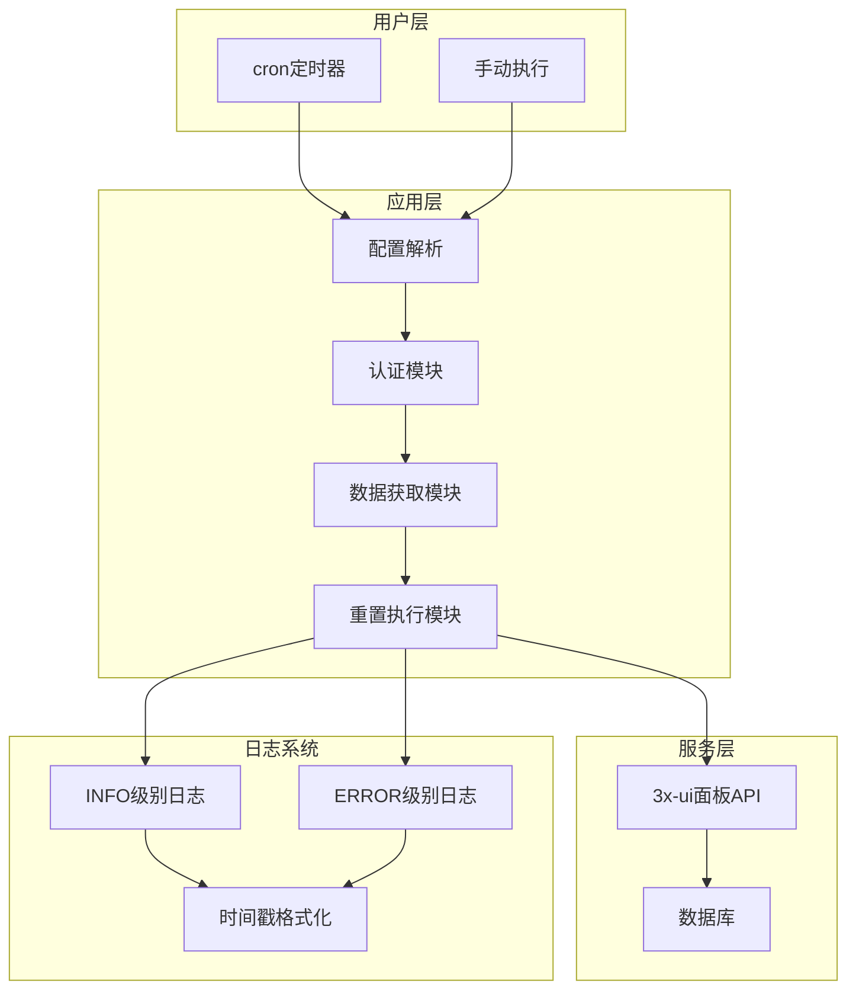
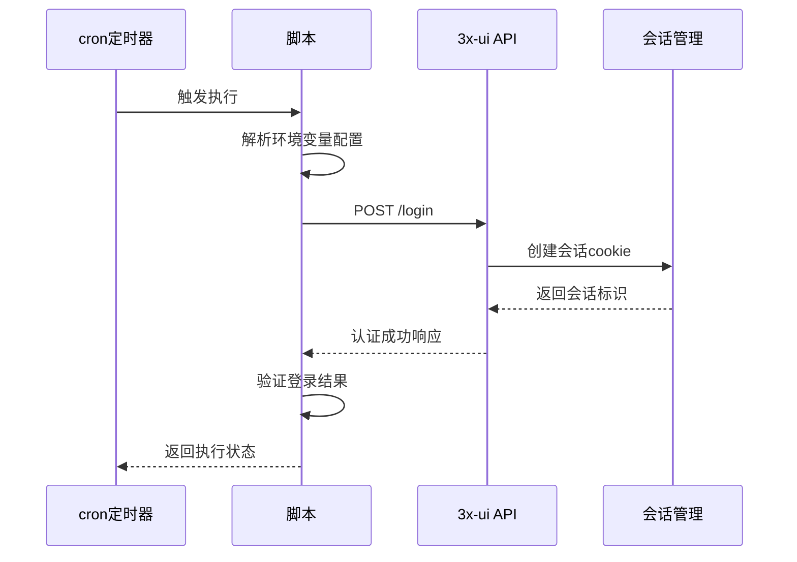
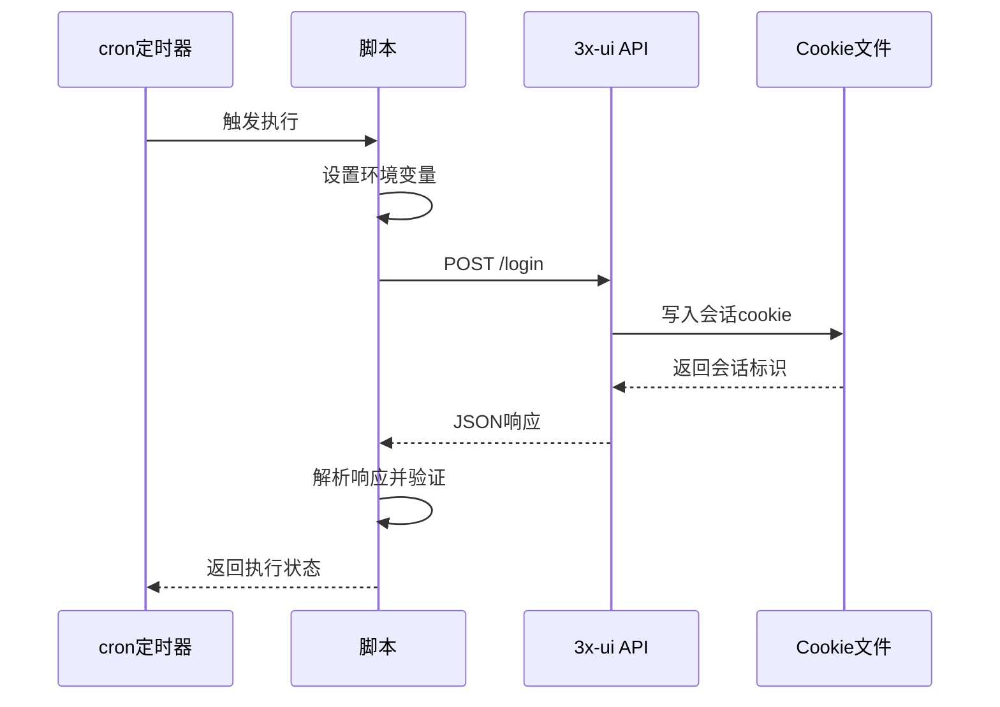
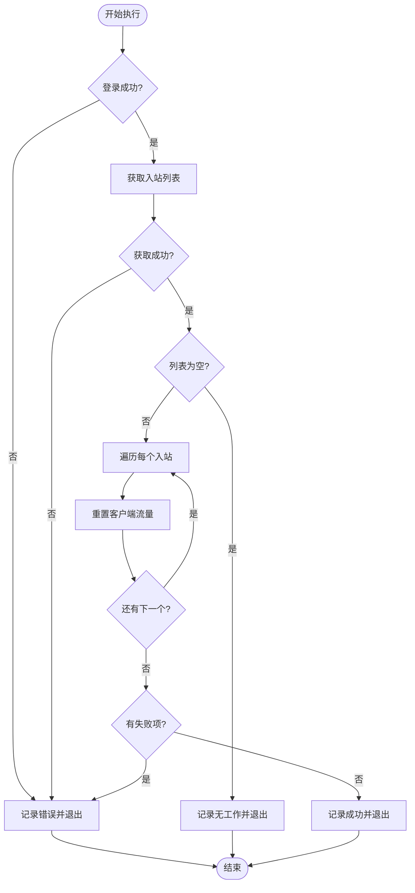
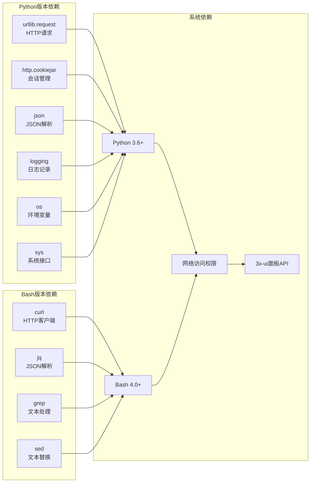
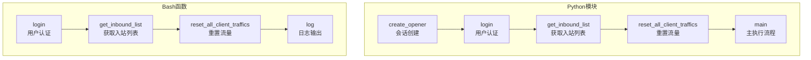

# 定时任务配置

<cite>
**本文档引用的文件**
- [README.md](file://README.md)
- [reset_traffic.py](file://reset_traffic.py)
- [reset_traffic.sh](file://reset_traffic.sh)
- [3x-uiConfiguration.md](file://3x-uiConfiguration.md)
</cite>

## 目录
1. [简介](#简介)
2. [项目结构](#项目结构)
3. [核心组件](#核心组件)
4. [架构概览](#架构概览)
5. [详细组件分析](#详细组件分析)
6. [依赖关系分析](#依赖关系分析)
7. [性能考虑](#性能考虑)
8. [故障排除指南](#故障排除指南)
9. [结论](#结论)
10. [附录](#附录)

## 简介

3x-ui流量重置工具是一个自动化脚本，用于定期重置3x-ui面板中所有入站(inbound)下客户端的已用流量。该工具提供了Python和Bash两种实现方式，支持通过环境变量或直接修改脚本配置来连接3x-ui面板API。

该工具的核心功能包括：
- 自动登录3x-ui面板获取会话
- 遍历所有入站，批量重置客户端流量
- 详细的日志输出和错误处理
- 适合配合cron定时执行

## 项目结构

该项目采用简洁的单文件架构，包含以下核心文件：



**图表来源**
- [reset_traffic.py:1-139](file://reset_traffic.py#L1-L139)
- [reset_traffic.sh:1-116](file://reset_traffic.sh#L1-L116)
- [README.md:16-23](file://README.md#L16-L23)

**章节来源**
- [README.md:16-23](file://README.md#L16-L23)

## 核心组件

### Python版本实现

Python版本使用标准库实现，具有以下特点：
- 使用urllib库进行HTTP请求
- 通过http.cookiejar管理会话状态
- 支持环境变量配置
- 结构化的错误处理和日志记录

### Bash版本实现

Bash版本依赖curl工具，具有以下特点：
- 使用临时cookie文件管理会话
- 通过管道和正则表达式解析JSON响应
- 错误处理和状态码检查
- 简洁的shell脚本结构

### 配置系统

两种实现都支持两种配置方式：
1. **环境变量方式**（推荐）：通过`XUI_PANEL_URL`、`XUI_USERNAME`、`XUI_PASSWORD`环境变量
2. **脚本内配置**：直接修改脚本中的配置常量

**章节来源**
- [reset_traffic.py:24-28](file://reset_traffic.py#L24-L28)
- [reset_traffic.sh:14-18](file://reset_traffic.sh#L14-L18)
- [README.md:28-52](file://README.md#L28-L52)

## 架构概览

该工具采用简单的三层架构：



**图表来源**
- [reset_traffic.py:44-98](file://reset_traffic.py#L44-L98)
- [reset_traffic.sh:29-108](file://reset_traffic.sh#L29-L108)

## 详细组件分析

### 认证流程组件

#### Python版本认证流程



**图表来源**
- [reset_traffic.py:44-64](file://reset_traffic.py#L44-L64)
- [reset_traffic.sh:29-53](file://reset_traffic.sh#L29-L53)

#### Bash版本认证流程



**图表来源**
- [reset_traffic.sh:29-53](file://reset_traffic.sh#L29-L53)

### 数据获取与处理组件

#### 入站列表获取流程



**图表来源**
- [reset_traffic.py:101-134](file://reset_traffic.py#L101-L134)
- [reset_traffic.sh:55-108](file://reset_traffic.sh#L55-L108)

### 错误处理机制

两种实现都具备完善的错误处理机制：

| 错误类型 | Python实现 | Bash实现 | 处理策略 |
|---------|-----------|---------|----------|
| 网络连接失败 | URLError异常捕获 | HTTP状态码检查 | 记录错误并返回非零退出码 |
| 认证失败 | JSON响应验证 | 成功标志检查 | 记录失败原因并退出 |
| API调用失败 | 超时和异常处理 | 响应状态码验证 | 逐项重试和错误报告 |
| 配置无效 | 环境变量默认值 | 变量替换机制 | 警告提示和优雅降级 |

**章节来源**
- [reset_traffic.py:62-64](file://reset_traffic.py#L62-L64)
- [reset_traffic.sh:41-51](file://reset_traffic.sh#L41-L51)

## 依赖关系分析

### 外部依赖



**图表来源**
- [reset_traffic.py:14-22](file://reset_traffic.py#L14-L22)
- [reset_traffic.sh:12](file://reset_traffic.sh#L12)
- [README.md:91-94](file://README.md#L91-L94)

### 内部模块依赖



**图表来源**
- [reset_traffic.py:38-98](file://reset_traffic.py#L38-L98)
- [reset_traffic.sh:23-108](file://reset_traffic.sh#L23-L108)

**章节来源**
- [reset_traffic.py:38-98](file://reset_traffic.py#L38-L98)
- [reset_traffic.sh:23-108](file://reset_traffic.sh#L23-L108)

## 性能考虑

### 执行效率优化

1. **并发处理**：当前实现采用串行处理方式，对于大量入站的情况可能需要优化
2. **超时设置**：所有API调用设置了合理的超时时间（30秒）
3. **连接复用**：Python版本使用持久连接，Bash版本每次重新建立连接

### 资源使用

- **内存占用**：主要取决于入站数量和客户端数量
- **网络带宽**：主要消耗在网络请求上
- **CPU使用**：主要用于JSON解析和字符串处理

### 扩展性建议

1. **批量处理**：可以考虑实现批量重置API调用
2. **缓存机制**：对入站列表进行缓存减少重复查询
3. **异步处理**：使用异步IO提高并发性能

## 故障排除指南

### 常见问题诊断

#### 网络连接问题

**症状**：脚本执行时报网络连接错误
**排查步骤**：
1. 检查3x-ui面板是否正常运行
2. 验证网络连通性
3. 检查防火墙设置
4. 确认API端点可达性

**解决方案**：
- 使用`ping`和`curl`测试连接
- 检查代理设置
- 验证SSL证书配置

#### 认证失败问题

**症状**：登录API返回认证失败
**排查步骤**：
1. 验证用户名和密码正确性
2. 检查面板管理员权限
3. 确认API端点路径正确

**解决方案**：
- 重新设置环境变量
- 直接修改脚本配置
- 检查面板安全设置

#### 权限问题

**症状**：脚本执行权限不足
**排查步骤**：
1. 检查脚本执行权限
2. 验证用户权限
3. 检查系统资源限制

**解决方案**：
- 添加执行权限：`chmod +x reset_traffic.sh`
- 使用sudo权限执行
- 检查系统限制设置

#### 日志分析

**章节来源**
- [reset_traffic.py:30-35](file://reset_traffic.py#L30-L35)
- [reset_traffic.sh:23-25](file://reset_traffic.sh#L23-L25)

## 结论

3x-ui流量重置工具提供了可靠的自动化流量重置解决方案。其设计具有以下优势：

1. **双语言支持**：同时提供Python和Bash版本，适应不同环境需求
2. **灵活配置**：支持环境变量和脚本内配置两种方式
3. **健壮性**：完善的错误处理和日志记录机制
4. **易用性**：简洁的安装和配置过程

该工具特别适合需要定期重置流量的场景，如按月计费的服务提供商或个人用户。

## 附录

### 定时任务配置示例

#### 基本cron配置

```bash
# 每月1号凌晨2点执行
0 2 1 * * /usr/bin/python3 /path/to/reset_traffic.py >> /var/log/3xui_reset.log 2>&1

# 或使用Bash版本
0 2 1 * * /path/to/reset_traffic.sh >> /var/log/3xui_reset.log 2>&1
```

#### 环境变量传递方式

```bash
# 在crontab中直接传递环境变量
0 2 1 * * XUI_PANEL_URL="http://127.0.0.1:2053" XUI_USERNAME="admin" XUI_PASSWORD="password" /path/to/reset_traffic.py >> /var/log/3xui_reset.log 2>&1
```

#### 不同Linux发行版的差异

| 发行版 | crond服务名 | 配置位置 | 特殊注意事项 |
|--------|------------|----------|-------------|
| Ubuntu/Debian | cron | /etc/crontab | 使用systemd管理 |
| CentOS/RHEL | crond | /etc/crontab | SELinux策略影响 |
| Fedora | crond | /etc/crontab | systemd服务管理 |
| Arch Linux | cronie | /etc/crontab | cronie服务 |
| openSUSE | cron | /etc/crontab | systemd集成 |

#### 监控和通知配置

**邮件通知配置**：
```bash
# 在crontab中添加邮件通知
0 2 1 * * /path/to/reset_traffic.py >> /var/log/3xui_reset.log 2>&1 && mail -s "3x-ui流量重置完成" admin@example.com < /var/log/3xui_reset.log
```

**日志轮转配置**：
```bash
# /etc/logrotate.d/3xui_reset
/var/log/3xui_reset.log {
    daily
    missingok
    rotate 52
    compress
    delaycompress
    notifempty
    create 644 root root
}
```

**章节来源**
- [README.md:64-77](file://README.md#L64-L77)
- [README.md:79-89](file://README.md#L79-L89)