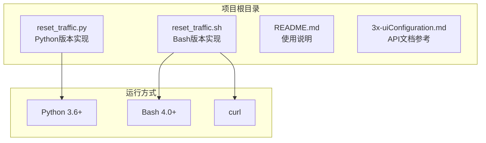
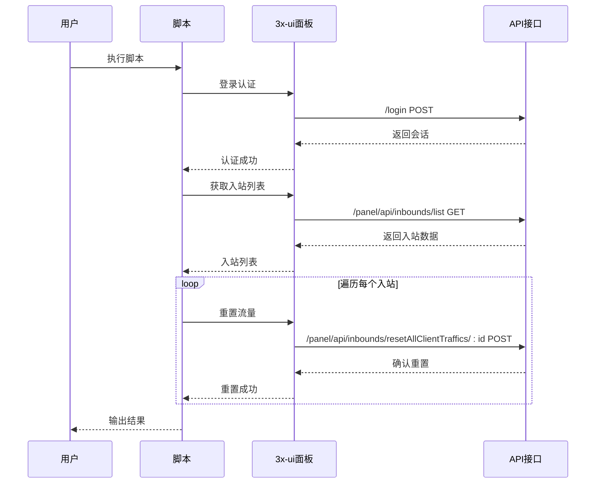
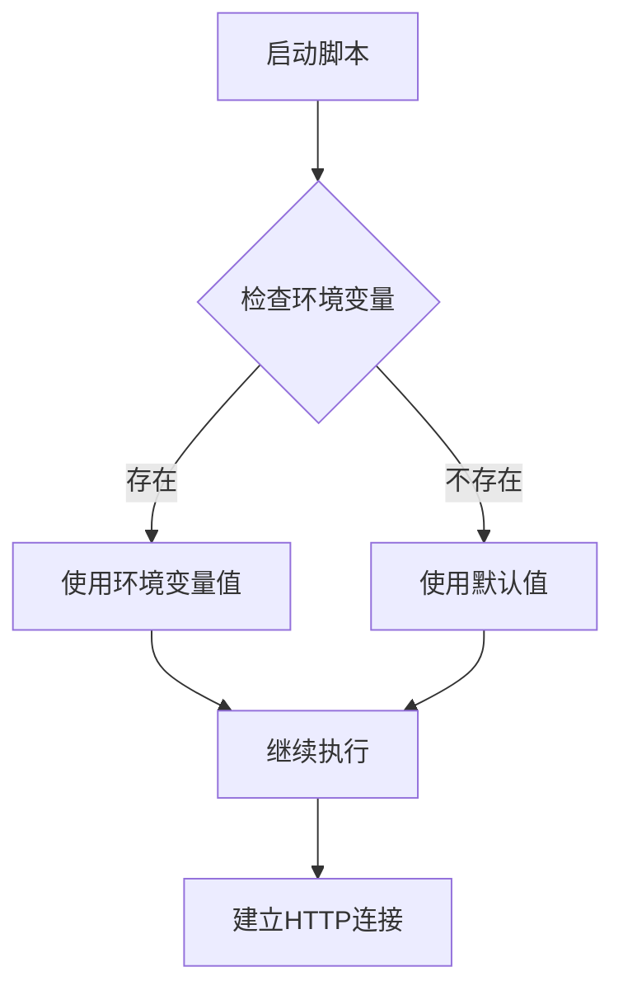
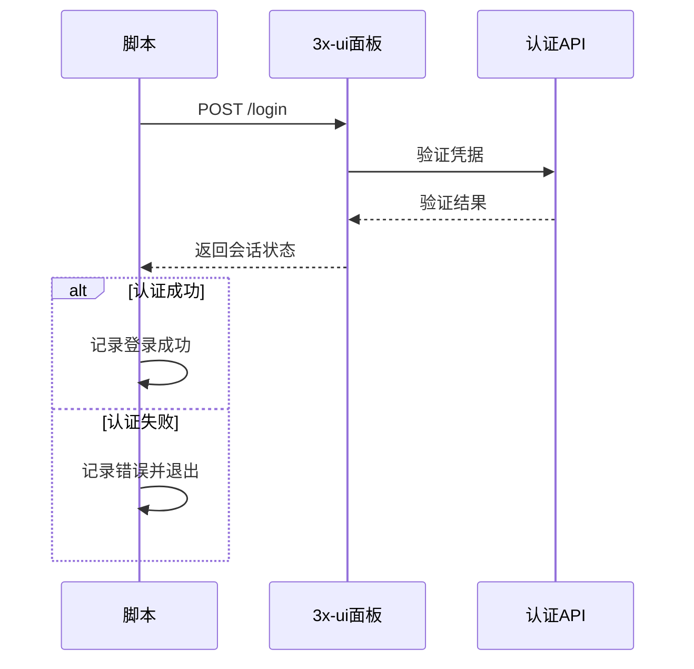
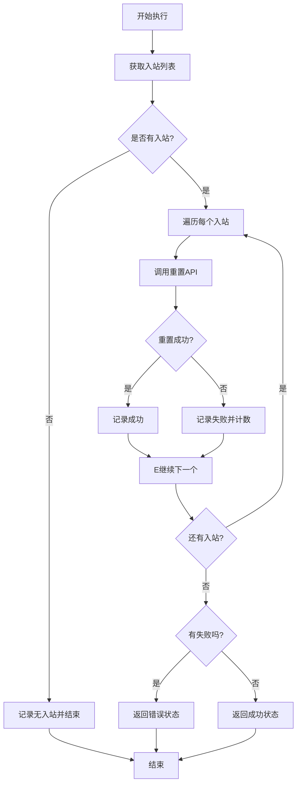
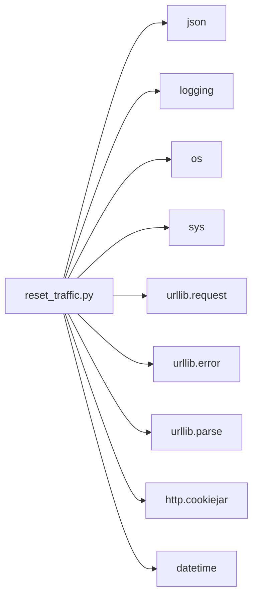
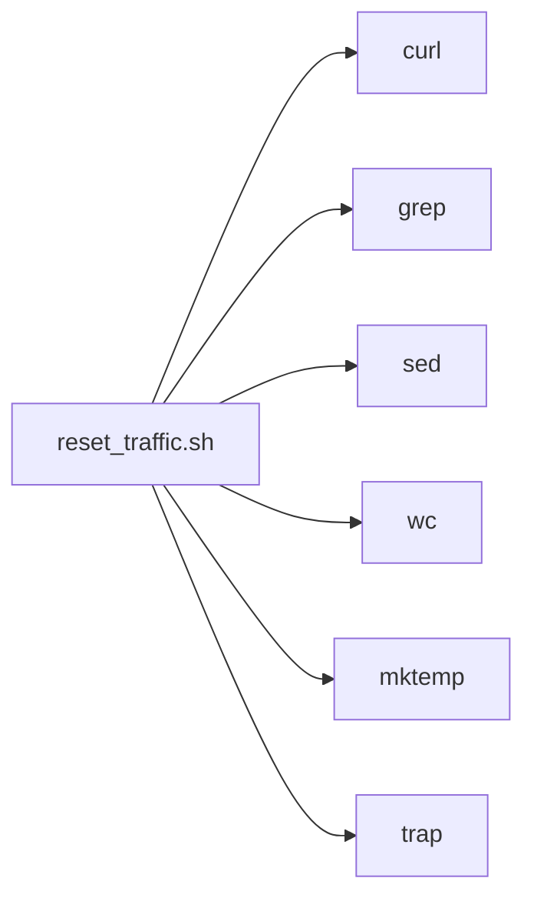

# 快速开始

<cite>
**本文引用的文件**
- [README.md](file://README.md)
- [3x-uiConfiguration.md](file://3x-uiConfiguration.md)
- [reset_traffic.py](file://reset_traffic.py)
- [reset_traffic.sh](file://reset_traffic.sh)
</cite>

## 目录
1. [简介](#简介)
2. [项目结构](#项目结构)
3. [核心组件](#核心组件)
4. [架构概览](#架构概览)
5. [详细组件分析](#详细组件分析)
6. [依赖关系分析](#依赖关系分析)
7. [性能考虑](#性能考虑)
8. [故障排除指南](#故障排除指南)
9. [结论](#结论)

## 简介

3x-ui流量重置工具是一个自动化脚本，用于通过调用3x-ui面板API来重置所有入站(inbound)下所有客户端的已用流量。该工具提供了Python 3和Bash两种实现方式，支持通过环境变量或直接修改脚本进行配置，并具备详细的日志输出功能，适合配合cron定时执行。

## 项目结构

该项目采用简洁的文件组织结构，包含核心脚本文件和文档说明：



**图表来源**
- [reset_traffic.py:1-139](file://reset_traffic.py#L1-L139)
- [reset_traffic.sh:1-116](file://reset_traffic.sh#L1-L116)
- [README.md:91-94](file://README.md#L91-L94)

**章节来源**
- [README.md:16-22](file://README.md#L16-L22)

## 核心组件

### Python版本实现

Python版本使用标准库实现，具有以下特点：
- 使用urllib库进行HTTP请求处理
- 通过http.cookiejar管理会话状态
- 支持环境变量配置覆盖默认值
- 提供详细的日志输出和错误处理

### Bash版本实现

Bash版本依赖curl进行HTTP通信，具有以下特点：
- 使用临时cookie文件管理会话
- 通过管道和正则表达式解析JSON响应
- 支持环境变量配置
- 提供完整的错误检查和状态码验证

**章节来源**
- [reset_traffic.py:14-35](file://reset_traffic.py#L14-L35)
- [reset_traffic.sh:12-25](file://reset_traffic.sh#L12-L25)

## 架构概览

该工具采用简单的三层架构模式：



**图表来源**
- [reset_traffic.py:44-98](file://reset_traffic.py#L44-L98)
- [reset_traffic.sh:29-108](file://reset_traffic.sh#L29-L108)

## 详细组件分析

### 配置系统

#### 环境变量配置（推荐方式）

两种实现都支持通过环境变量进行配置，这是推荐的方式：



**图表来源**
- [reset_traffic.py:25-28](file://reset_traffic.py#L25-L28)
- [reset_traffic.sh:15-17](file://reset_traffic.sh#L15-L17)

#### 直接修改脚本配置

如果选择直接修改脚本，需要编辑配置区域：

**章节来源**
- [README.md:28-52](file://README.md#L28-L52)

### 认证流程

两个版本都实现了相同的认证逻辑：



**图表来源**
- [reset_traffic.py:44-64](file://reset_traffic.py#L44-L64)
- [reset_traffic.sh:29-53](file://reset_traffic.sh#L29-L53)

### 入站流量重置流程



**图表来源**
- [reset_traffic.py:67-98](file://reset_traffic.py#L67-L98)
- [reset_traffic.sh:55-108](file://reset_traffic.sh#L55-L108)

**章节来源**
- [reset_traffic.py:101-134](file://reset_traffic.py#L101-L134)
- [reset_traffic.sh:77-115](file://reset_traffic.sh#L77-L115)

## 依赖关系分析

### Python版本依赖

Python版本仅使用标准库，无需额外依赖：



**图表来源**
- [reset_traffic.py:14-22](file://reset_traffic.py#L14-L22)

### Bash版本依赖

Bash版本依赖系统工具：



**图表来源**
- [reset_traffic.sh:20-21](file://reset_traffic.sh#L20-L21)

**章节来源**
- [README.md:91-94](file://README.md#L91-L94)

## 性能考虑

### 并发处理

当前实现采用串行处理方式，对大量入站的情况可能需要更长的执行时间。如果需要改进性能，可以考虑：

1. **并发重置**：使用多线程或多进程同时处理多个入站
2. **批量操作**：利用API提供的批量重置功能
3. **缓存机制**：缓存入站列表减少重复查询

### 超时设置

两个版本都设置了合理的超时时间：
- 连接超时：10秒
- 总执行超时：30秒

这可以避免长时间阻塞导致的问题。

## 故障排除指南

### 常见配置问题

#### 1. 面板URL配置错误

**问题症状**：脚本显示无法连接面板
**解决方法**：
- 确认面板URL包含协议(http/https)和端口号
- 检查防火墙是否允许访问
- 验证面板服务是否正常运行

#### 2. 认证失败

**问题症状**：显示登录失败或认证错误
**解决方法**：
- 检查用户名和密码是否正确
- 确认面板用户权限足够
- 验证面板是否启用了API访问

#### 3. 网络连接问题

**问题症状**：HTTP状态码非200
**解决方法**：
- 检查网络连通性
- 验证防火墙设置
- 确认DNS解析正常

### 调试技巧

#### 启用详细日志

Python版本使用标准logging模块，可以在运行时查看详细信息：
- 查看脚本输出中的时间戳和详细消息
- 检查是否有具体的错误描述

#### 手动测试API

可以使用curl手动测试API端点：
```bash
# 测试登录
curl -X POST "${PANEL_URL}/login" -H "Content-Type: application/json" -d '{"username":"admin","password":"your_password"}'

# 获取入站列表
curl -X GET "${PANEL_URL}/panel/api/inbounds/list"
```

**章节来源**
- [reset_traffic.py:30-35](file://reset_traffic.py#L30-L35)
- [reset_traffic.sh:23-25](file://reset_traffic.sh#L23-L25)

## 结论

3x-ui流量重置工具提供了简单可靠的自动化解决方案。通过环境变量配置和两种语言实现，用户可以根据自己的需求选择最适合的方式。建议：

1. **优先使用环境变量配置**：便于在不同环境中复用
2. **配合cron定时执行**：实现自动化的流量重置
3. **定期检查日志**：监控脚本执行状态
4. **备份重要数据**：在生产环境中谨慎操作

该工具为3x-ui面板的日常维护提供了便利，特别是对于需要定期重置流量的场景非常实用。