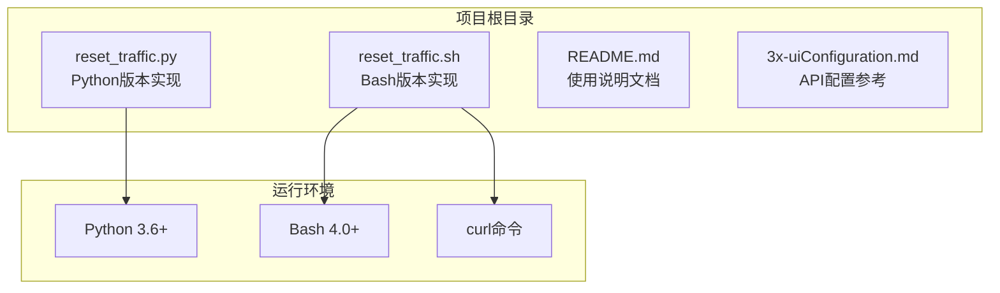
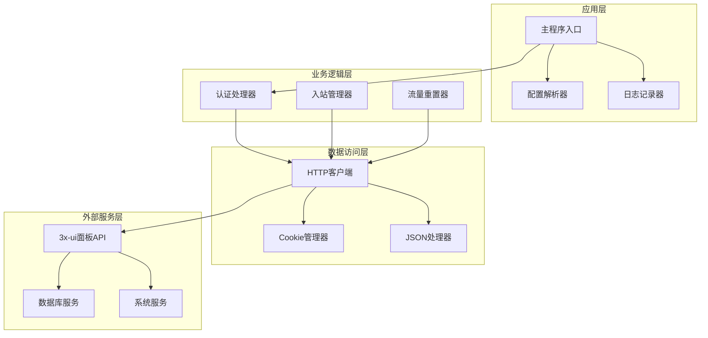
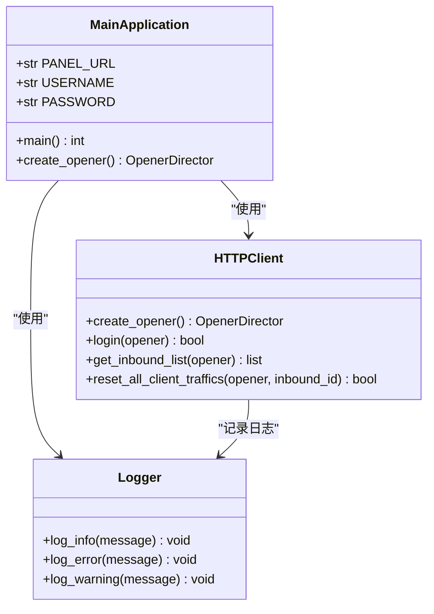
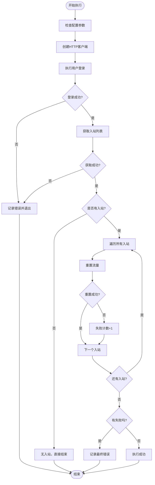
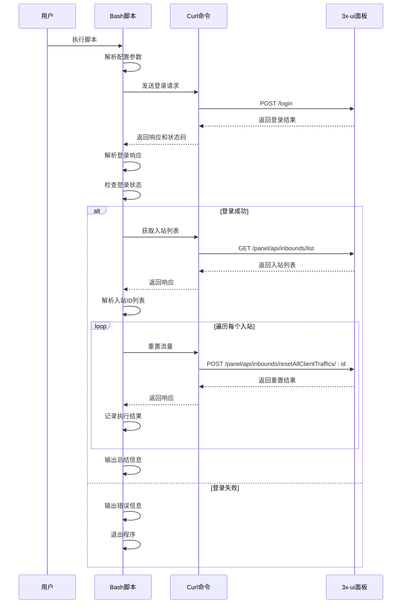
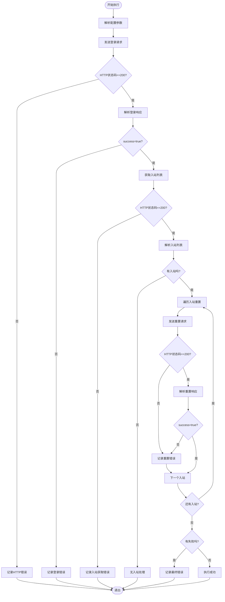
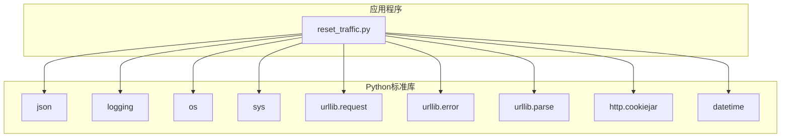
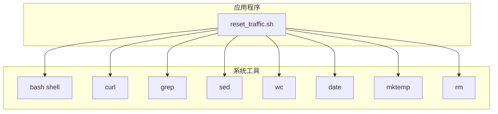

# 故障排除

<cite>
**本文引用的文件**
- [README.md](file://README.md)
- [reset_traffic.py](file://reset_traffic.py)
- [reset_traffic.sh](file://reset_traffic.sh)
- [3x-uiConfiguration.md](file://3x-uiConfiguration.md)
</cite>

## 目录
1. [简介](#简介)
2. [项目结构](#项目结构)
3. [核心组件](#核心组件)
4. [架构概览](#架构概览)
5. [详细组件分析](#详细组件分析)
6. [依赖关系分析](#依赖关系分析)
7. [性能考虑](#性能考虑)
8. [故障排除指南](#故障排除指南)
9. [结论](#结论)
10. [附录](#附录)

## 简介

3x-ui流量重置工具是一个自动化脚本集合，用于定期重置3x-ui面板中所有入站(inbound)下客户端的已用流量。该工具提供了Python 3和Bash两种实现方式，支持通过环境变量或直接修改脚本配置的方式进行部署，并且可以与cron定时任务集成，实现每月自动执行。

该工具的核心功能是通过调用3x-ui面板的API接口，自动登录并遍历所有入站，批量重置客户端流量，确保流量统计的准确性。

## 项目结构

该项目采用简洁的单文件架构，包含以下核心文件：



**图表来源**
- [reset_traffic.py:1-139](file://reset_traffic.py#L1-L139)
- [reset_traffic.sh:1-116](file://reset_traffic.sh#L1-L116)
- [README.md:91-95](file://README.md#L91-L95)

**章节来源**
- [README.md:16-23](file://README.md#L16-L23)
- [README.md:91-95](file://README.md#L91-L95)

## 核心组件

### Python版本组件

Python版本实现了完整的面向对象设计，包含以下主要组件：

1. **配置管理模块**：通过环境变量或默认值管理面板连接参数
2. **HTTP客户端模块**：使用urllib库处理HTTP请求和Cookie管理
3. **认证模块**：处理用户登录和会话管理
4. **API调用模块**：封装对3x-ui API的各种操作
5. **日志记录模块**：提供结构化的日志输出

### Bash版本组件

Bash版本采用函数化设计，包含以下核心组件：

1. **配置解析模块**：处理环境变量和默认配置
2. **HTTP请求模块**：使用curl命令处理API调用
3. **JSON解析模块**：使用grep和sed命令解析API响应
4. **错误处理模块**：提供详细的错误信息和状态码检查
5. **日志记录模块**：格式化输出执行日志

**章节来源**
- [reset_traffic.py:24-28](file://reset_traffic.py#L24-L28)
- [reset_traffic.sh:14-18](file://reset_traffic.sh#L14-L18)

## 架构概览

该工具采用分层架构设计，从上到下分为应用层、业务逻辑层、数据访问层和外部服务层：



**图表来源**
- [reset_traffic.py:38-99](file://reset_traffic.py#L38-L99)
- [reset_traffic.sh:29-108](file://reset_traffic.sh#L29-L108)

## 详细组件分析

### Python版本详细分析

#### 类结构图



**图表来源**
- [reset_traffic.py:38-139](file://reset_traffic.py#L38-L139)

#### 关键方法流程图



**图表来源**
- [reset_traffic.py:101-135](file://reset_traffic.py#L101-L135)

**章节来源**
- [reset_traffic.py:38-139](file://reset_traffic.py#L38-L139)

### Bash版本详细分析

#### 函数调用序列图



**图表来源**
- [reset_traffic.sh:29-116](file://reset_traffic.sh#L29-L116)

#### 错误处理流程图



**图表来源**
- [reset_traffic.sh:41-116](file://reset_traffic.sh#L41-L116)

**章节来源**
- [reset_traffic.sh:29-116](file://reset_traffic.sh#L29-L116)

## 依赖关系分析

### Python版本依赖关系



**图表来源**
- [reset_traffic.py:14-22](file://reset_traffic.py#L14-L22)

### Bash版本依赖关系



**图表来源**
- [reset_traffic.sh:1-116](file://reset_traffic.sh#L1-L116)

**章节来源**
- [README.md:91-95](file://README.md#L91-L95)

## 性能考虑

### Python版本性能特点

1. **内存使用**：Python版本使用标准库，内存占用相对较低
2. **执行效率**：单线程执行，适合定时任务场景
3. **网络超时**：设置了合理的超时时间(30秒)，避免长时间阻塞
4. **并发处理**：当前实现为串行处理，如需提升性能可考虑异步处理

### Bash版本性能特点

1. **启动开销**：Bash版本启动速度快，适合快速执行
2. **系统资源**：依赖系统工具，资源消耗较低
3. **网络超时**：同样设置了连接超时和最大执行时间
4. **错误处理**：使用pipefail模式，确保管道中的错误被正确捕获

### 优化建议

1. **批量处理**：对于大量入站的情况，可考虑分批处理
2. **重试机制**：添加网络请求的重试逻辑
3. **进度显示**：在大量入站时提供进度指示
4. **并发控制**：根据系统资源限制并发数量

## 故障排除指南

### 常见问题及解决方案

#### 1. 认证失败问题

**症状表现**：
- 登录API返回错误
- 脚本输出"登录失败"信息
- HTTP状态码非200

**诊断步骤**：
1. 验证面板URL是否正确
2. 检查用户名和密码是否正确
3. 确认面板服务正常运行
4. 验证API端点可用性

**解决方案**：
- 使用环境变量方式配置参数
- 直接修改脚本中的默认值
- 检查防火墙和网络连接
- 验证3x-ui面板的登录功能

**章节来源**
- [reset_traffic.py:44-64](file://reset_traffic.py#L44-L64)
- [reset_traffic.sh:41-51](file://reset_traffic.sh#L41-L51)

#### 2. 网络连接问题

**症状表现**：
- 脚本无法连接到3x-ui面板
- 超时错误或连接拒绝
- DNS解析失败

**诊断步骤**：
1. 使用ping命令测试面板主机连通性
2. 使用telnet或nc测试端口连通性
3. 检查防火墙规则
4. 验证DNS解析是否正常

**解决方案**：
- 检查网络配置和路由
- 配置代理服务器(如需要)
- 调整超时参数
- 验证SSL证书(如使用HTTPS)

**章节来源**
- [reset_traffic.py:54-64](file://reset_traffic.py#L54-L64)
- [reset_traffic.sh:35-36](file://reset_traffic.sh#L35-L36)

#### 3. API调用错误

**症状表现**：
- 获取入站列表失败
- 重置流量操作失败
- JSON解析错误

**诊断步骤**：
1. 检查API端点路径是否正确
2. 验证请求格式和参数
3. 查看API响应内容
4. 确认权限设置

**解决方案**：
- 更新API端点到最新版本
- 检查请求头设置
- 验证JSON格式
- 确保有足够的权限

**章节来源**
- [reset_traffic.py:67-98](file://reset_traffic.py#L67-L98)
- [reset_traffic.sh:55-108](file://reset_traffic.sh#L55-L108)

#### 4. Python版本特定问题

**症状表现**：
- 导入模块失败
- Unicode编码错误
- Cookie处理异常

**诊断步骤**：
1. 检查Python版本兼容性
2. 验证标准库完整性
3. 检查字符编码设置
4. 确认网络库可用性

**解决方案**：
- 升级到Python 3.6+
- 检查locale设置
- 验证urllib库完整性
- 确认网络访问权限

**章节来源**
- [reset_traffic.py:14-22](file://reset_traffic.py#L14-L22)

#### 5. Bash版本特定问题

**症状表现**：
- curl命令找不到
- grep/sed命令错误
- 权限不足
- 变量未定义

**诊断步骤**：
1. 检查curl命令是否存在
2. 验证shell语法
3. 检查文件执行权限
4. 确认环境变量设置

**解决方案**：
- 安装curl工具
- 检查shell脚本语法
- 设置执行权限(+x)
- 使用export命令设置环境变量

**章节来源**
- [reset_traffic.sh:12-18](file://reset_traffic.sh#L12-L18)

### 日志分析方法

#### Python版本日志分析

1. **日志格式**：`YYYY-MM-DD HH:MM:SS [级别] 消息`
2. **关键信息**：登录状态、入站数量、执行结果
3. **错误定位**：查看最近的日志条目
4. **调试模式**：可调整日志级别获取更多信息

#### Bash版本日志分析

1. **日志格式**：`YYYY-MM-DD HH:MM:SS [级别] 消息`
2. **HTTP状态码**：关注4xx和5xx错误
3. **API响应**：检查success字段和msg消息
4. **执行时间**：监控脚本执行耗时

**章节来源**
- [reset_traffic.py:30-35](file://reset_traffic.py#L30-L35)
- [reset_traffic.sh:23-25](file://reset_traffic.sh#L23-L25)

### 系统环境排查

#### Python环境检查

1. **版本检查**：`python3 --version`
2. **依赖检查**：确认标准库完整
3. **网络检查**：测试urllib功能
4. **权限检查**：确认脚本执行权限

#### Bash环境检查

1. **版本检查**：`bash --version`
2. **工具检查**：`which curl grep sed`
3. **权限检查**：`ls -la reset_traffic.sh`
4. **环境变量**：`env | grep XUI_`

**章节来源**
- [README.md:93-94](file://README.md#L93-L94)

### 网络连通性检查

#### 基础连通性测试

1. **Ping测试**：`ping panel-hostname`
2. **端口测试**：`telnet panel-hostname 2053`
3. **DNS解析**：`nslookup panel-hostname`
4. **路由检查**：`traceroute panel-hostname`

#### API可用性测试

1. **登录测试**：`curl -X POST /login -d '{}'`
2. **列表测试**：`curl -X GET /panel/api/inbounds/list`
3. **重置测试**：`curl -X POST /panel/api/inbounds/resetAllClientTraffics/1`
4. **认证测试**：检查Cookie设置

**章节来源**
- [reset_traffic.py:46-47](file://reset_traffic.py#L46-L47)
- [reset_traffic.sh:30-36](file://reset_traffic.sh#L30-L36)

### 权限问题排查

#### 文件权限检查

1. **脚本权限**：`chmod +x reset_traffic.py reset_traffic.sh`
2. **日志文件**：检查/var/log目录写权限
3. **临时文件**：确认/tmp目录可用性
4. **配置文件**：检查环境变量设置

#### 系统权限检查

1. **用户权限**：确认执行用户权限
2. **防火墙规则**：检查iptables配置
3. **SELinux/AppArmor**：验证安全策略
4. **资源限制**：检查ulimit设置

**章节来源**
- [reset_traffic.py:104-105](file://reset_traffic.py#L104-L105)
- [reset_traffic.sh:20-21](file://reset_traffic.sh#L20-L21)

### 配置验证方法

#### 环境变量验证

1. **设置检查**：`echo $XUI_PANEL_URL $XUI_USERNAME $XUI_PASSWORD`
2. **临时设置**：`export XUI_PANEL_URL="http://127.0.0.1:2053"`
3. **脚本内验证**：在脚本中添加调试输出
4. **配置文件**：检查/etc/profile或其他配置文件

#### 面板配置验证

1. **API端点**：确认API路径正确
2. **认证机制**：验证用户名密码
3. **权限设置**：检查API访问权限
4. **服务状态**：确认面板服务运行正常

**章节来源**
- [README.md:28-52](file://README.md#L28-L52)

### 性能问题诊断

#### 执行时间分析

1. **脚本执行时间**：使用`time`命令测量
2. **网络延迟**：使用`curl -w`选项分析
3. **API响应时间**：监控各API调用耗时
4. **系统负载**：检查CPU和内存使用

#### 优化建议

1. **并发控制**：限制同时处理的入站数量
2. **缓存机制**：复用登录会话
3. **批量处理**：合并相似操作
4. **资源监控**：设置适当的超时值

**章节来源**
- [reset_traffic.py:54-56](file://reset_traffic.py#L54-L56)
- [reset_traffic.sh:35-36](file://reset_traffic.sh#L35-L36)

### 社区支持和问题反馈

#### 官方资源

1. **GitHub仓库**：查找项目主页和Issue页面
2. **文档站点**：访问官方文档和API文档
3. **社区论坛**：参与相关技术讨论
4. **问题报告**：按照模板提交Bug报告

#### 问题反馈渠道

1. **GitHub Issues**：提交详细的Bug报告
2. **邮件联系**：通过官方邮箱反馈问题
3. **社交媒体**：在相关平台寻求帮助
4. **技术论坛**：参与技术交流和讨论

#### 问题报告模板

当遇到问题时，建议提供以下信息：
- 系统环境信息
- 脚本版本和配置
- 详细的错误日志
- 复现步骤和期望结果
- 相关的网络配置

**章节来源**
- [README.md:108-129](file://README.md#L108-L129)

## 结论

3x-ui流量重置工具提供了可靠的自动化解决方案，能够有效管理3x-ui面板中的流量统计。通过本文档提供的故障排除指南，用户可以快速识别和解决常见的配置、网络和权限问题。

关键要点包括：
1. 正确配置环境变量和面板参数
2. 确保网络连通性和API可用性
3. 合理设置执行权限和系统资源
4. 建立完善的日志监控机制
5. 利用社区资源获取技术支持

通过遵循本文档的指导原则和最佳实践，用户可以确保脚本的稳定运行，并在出现问题时快速定位和解决。

## 附录

### 快速故障排除清单

- [ ] 检查面板URL和端口配置
- [ ] 验证用户名和密码正确性
- [ ] 确认网络连通性和防火墙设置
- [ ] 检查API端点和权限配置
- [ ] 验证脚本执行权限
- [ ] 查看详细的日志输出
- [ ] 测试独立的API调用
- [ ] 检查系统时间和时区设置

### 常用诊断命令

```bash
# 基础网络测试
ping panel-hostname
telnet panel-hostname 2053
nslookup panel-hostname

# API测试
curl -v -X POST "${PANEL_URL}/login" -H "Content-Type: application/json" -d '{"username":"${USERNAME}","password":"${PASSWORD}"}'

# 日志查看
tail -f /var/log/3xui_reset.log
journalctl -u reset-traffic.service

# 系统检查
ps aux | grep reset_traffic
netstat -tlnp | grep :2053
```