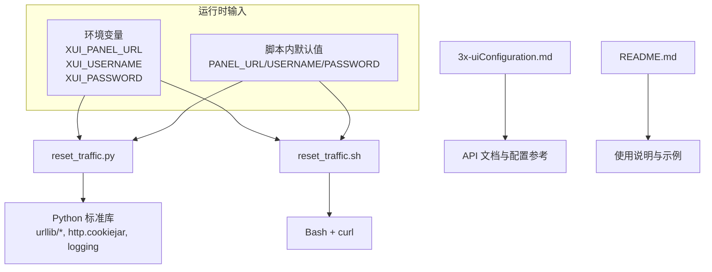
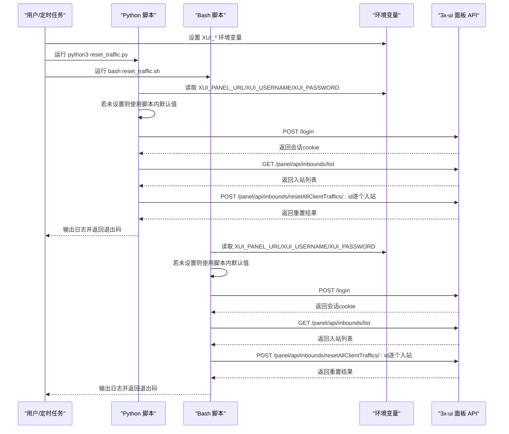
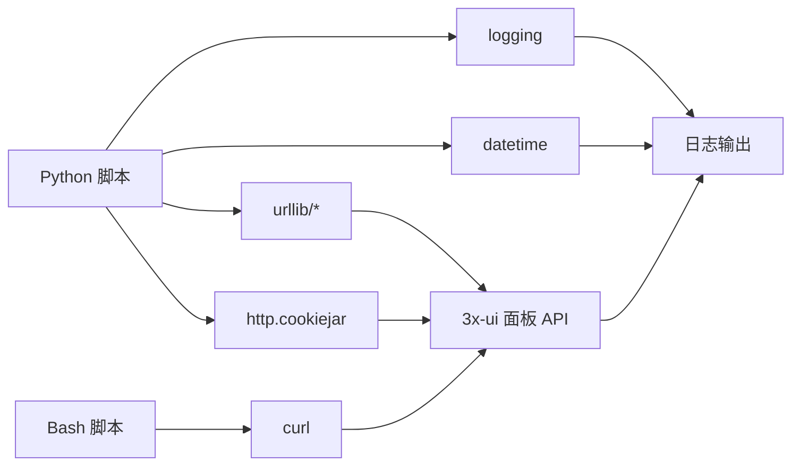

# 配置指南

<cite>
**本文引用的文件**
- [README.md](file://README.md)
- [3x-uiConfiguration.md](file://3x-uiConfiguration.md)
- [reset_traffic.py](file://reset_traffic.py)
- [reset_traffic.sh](file://reset_traffic.sh)
</cite>

## 目录
1. [简介](#简介)
2. [项目结构](#项目结构)
3. [核心组件](#核心组件)
4. [架构总览](#架构总览)
5. [详细组件分析](#详细组件分析)
6. [依赖关系分析](#依赖关系分析)
7. [性能与可靠性考量](#性能与可靠性考量)
8. [故障排查指南](#故障排查指南)
9. [结论](#结论)
10. [附录](#附录)

## 简介
本指南面向需要在3x-ui面板中自动化“每月重置所有客户端已用流量”的用户，系统性讲解环境变量配置方法、脚本内部配置修改位置、安全最佳实践、参数优先级与覆盖规则、不同部署环境下的配置示例，以及配置验证与常见错误排查方法。该工具同时提供Python与Bash两个版本，均通过调用3x-ui面板的API完成登录、获取入站列表、批量重置客户端流量。

## 项目结构
- reset_traffic.py：Python版本实现，使用标准库进行HTTP请求与日志记录。
- reset_traffic.sh：Bash版本实现，使用curl进行HTTP请求与日志记录。
- 3x-uiConfiguration.md：3x-ui API与配置参考文档（用于理解API端点与面板配置项）。
- README.md：功能说明、使用方法、API说明、许可证与免责声明。

图表来源
- [reset_traffic.py:24-28](file://reset_traffic.py#L24-L28)
- [reset_traffic.sh:14-18](file://reset_traffic.sh#L14-L18)
- [README.md:26-52](file://README.md#L26-L52)

章节来源
- [README.md:16-23](file://README.md#L16-L23)
- [README.md:96-106](file://README.md#L96-L106)

## 核心组件
- 环境变量配置区
  - Python版本：通过环境变量覆盖默认值，优先级高于脚本内默认值。
  - Bash版本：通过环境变量覆盖默认值，优先级高于脚本内默认值。
- 脚本内部配置区
  - Python版本：在配置区域直接设置PANEL_URL、USERNAME、PASSWORD。
  - Bash版本：在配置区域直接设置PANEL_URL、USERNAME、PASSWORD。
- 登录与API交互
  - 登录：POST /login
  - 获取入站：GET /panel/api/inbounds/list
  - 重置流量：POST /panel/api/inbounds/resetAllClientTraffics/:id
- 日志与错误处理
  - 统一格式化日志输出；对HTTP状态码与响应体中的success字段进行判断；失败计数并返回非零退出码。

章节来源
- [reset_traffic.py:24-28](file://reset_traffic.py#L24-L28)
- [reset_traffic.sh:14-18](file://reset_traffic.sh#L14-L18)
- [reset_traffic.py:44-64](file://reset_traffic.py#L44-L64)
- [reset_traffic.py:67-82](file://reset_traffic.py#L67-L82)
- [reset_traffic.py:85-98](file://reset_traffic.py#L85-L98)
- [reset_traffic.sh:29-51](file://reset_traffic.sh#L29-L51)
- [reset_traffic.sh:55-75](file://reset_traffic.sh#L55-L75)
- [reset_traffic.sh:88-108](file://reset_traffic.sh#L88-L108)
- [README.md:96-106](file://README.md#L96-L106)

## 架构总览
下图展示了从脚本到3x-ui面板的调用流程，以及环境变量与脚本默认值之间的优先级关系。

图表来源
- [reset_traffic.py:24-28](file://reset_traffic.py#L24-L28)
- [reset_traffic.py:44-64](file://reset_traffic.py#L44-L64)
- [reset_traffic.py:67-82](file://reset_traffic.py#L67-L82)
- [reset_traffic.py:85-98](file://reset_traffic.py#L85-L98)
- [reset_traffic.sh:14-18](file://reset_traffic.sh#L14-L18)
- [reset_traffic.sh:29-51](file://reset_traffic.sh#L29-L51)
- [reset_traffic.sh:55-75](file://reset_traffic.sh#L55-L75)
- [reset_traffic.sh:88-108](file://reset_traffic.sh#L88-L108)

## 详细组件分析

### 环境变量配置方法
- 可用变量
  - XUI_PANEL_URL：3x-ui面板地址（不含末尾斜杠），例如 http://127.0.0.1:2053 或 https://your-domain.com。
  - XUI_USERNAME：面板用户名。
  - XUI_PASSWORD：面板密码。
- 作用
  - 作为运行时配置源，优先于脚本内的默认值。
  - 便于在不同环境中切换，也便于通过定时任务一次性注入。
- 优先级与覆盖规则
  - Python版本：os.getenv("XUI_PANEL_URL", 默认值)，若未设置则使用脚本内默认值。
  - Bash版本：${XUI_PANEL_URL:-默认值}，若未设置则使用脚本内默认值。
  - 因此，当通过命令行或定时任务显式导出环境变量时，将覆盖脚本内的默认值。
- 修改位置
  - Python版本：在配置区域设置PANEL_URL、USERNAME、PASSWORD，这些变量受环境变量影响。
  - Bash版本：在配置区域设置PANEL_URL、USERNAME、PASSWORD，这些变量受环境变量影响。

章节来源
- [README.md:28-52](file://README.md#L28-L52)
- [reset_traffic.py:24-28](file://reset_traffic.py#L24-L28)
- [reset_traffic.sh:14-18](file://reset_traffic.sh#L14-L18)

### 脚本内部配置修改
- Python版本
  - 修改位置：配置区域（PANEL_URL、USERNAME、PASSWORD）。
  - 影响：若未设置环境变量，将使用此处的默认值。
- Bash版本
  - 修改位置：配置区域（PANEL_URL、USERNAME、PASSWORD）。
  - 影响：若未设置环境变量，将使用此处的默认值。

章节来源
- [reset_traffic.py:24-28](file://reset_traffic.py#L24-L28)
- [reset_traffic.sh:14-18](file://reset_traffic.sh#L14-L18)

### 安全配置最佳实践
- 密码存储
  - 建议通过环境变量注入，避免将明文密码写入脚本或版本控制。
  - 在容器或CI/CD中使用密钥管理服务（如Kubernetes Secret、Vault等）注入环境变量。
- 权限设置
  - 脚本文件权限建议为仅执行者可读写（例如 600），以减少泄露风险。
  - 定时任务日志文件建议限制权限（例如 640），仅允许特定用户读取。
- 网络与证书
  - 若使用HTTPS，请确保服务器证书有效且被系统信任。
  - 如需自签证书，请在运行环境中正确安装CA证书或在调用前忽略校验（不推荐）。
- 最小权限原则
  - 面板用户仅授予必要权限，避免使用管理员账户。
- 审计与监控
  - 启用并定期检查日志，关注登录失败、API调用异常等信息。

章节来源
- [README.md:91-95](file://README.md#L91-L95)

### 参数优先级与覆盖规则
- 优先级顺序（从高到低）
  1) 命令行/定时任务显式导出的环境变量（XUI_*）
  2) 脚本内默认值（配置区域）
- 覆盖规则
  - Python版本：os.getenv(key, default)。若环境变量存在，则使用环境变量值；否则使用default。
  - Bash版本：${KEY:-default}。若环境变量存在，则使用环境变量值；否则使用default。
- 示例
  - 通过定时任务一次性注入：在crontab中直接导出XUI_*变量，即可覆盖脚本默认值。
  - 临时调试：在当前shell中导出XUI_*变量后运行脚本，仅本次生效。

章节来源
- [reset_traffic.py:24-28](file://reset_traffic.py#L24-L28)
- [reset_traffic.sh:14-18](file://reset_traffic.sh#L14-L18)
- [README.md:64-77](file://README.md#L64-L77)

### 不同部署环境下的配置示例
- 本地测试环境
  - 使用默认地址与默认凭据进行快速验证，随后切换为实际面板地址与真实凭据。
  - 建议先手动运行一次，确认日志输出与API响应正常。
- 生产环境
  - 通过环境变量注入，避免硬编码在脚本中。
  - 将脚本加入系统crontab，按月执行（例如每月1日2点）。
  - 配置专用日志文件路径，并设置合理的轮转策略。
- Docker/Kubernetes
  - 使用环境变量注入（如docker run -e或k8s Deployment的env）。
  - 将脚本挂载为只读卷，日志输出至标准输出或挂载的日志目录。
- 云函数/无服务器
  - 通过平台提供的环境变量注入机制设置XUI_*。
  - 注意超时与网络连通性，必要时开启重试与降级策略。

章节来源
- [README.md:26-52](file://README.md#L26-L52)
- [README.md:64-77](file://README.md#L64-L77)

### 配置验证方法
- 登录验证
  - 观察登录阶段是否输出“登录成功”，以及HTTP状态码是否为200。
  - 若失败，检查面板URL、用户名、密码是否正确。
- 入站列表验证
  - 观察是否能获取到入站数量，若为0则无需重置。
- 逐个入站重置验证
  - 对每个入站ID执行重置操作，观察对应日志是否显示“已重置”。
  - 若部分失败，记录失败数量与错误消息，定位具体入站问题。
- 日志示例
  - 参考README中的日志示例，核对时间戳、关键步骤与结束标记。

章节来源
- [reset_traffic.py:44-64](file://reset_traffic.py#L44-L64)
- [reset_traffic.py:67-82](file://reset_traffic.py#L67-L82)
- [reset_traffic.py:85-98](file://reset_traffic.py#L85-L98)
- [reset_traffic.sh:29-51](file://reset_traffic.sh#L29-L51)
- [reset_traffic.sh:55-75](file://reset_traffic.sh#L55-L75)
- [reset_traffic.sh:88-108](file://reset_traffic.sh#L88-L108)
- [README.md:79-89](file://README.md#L79-L89)

### 常见配置错误与排查
- 面板地址错误
  - 症状：登录阶段HTTP状态码非200或“无法连接面板”。
  - 排查：确认XUI_PANEL_URL是否包含协议与端口，域名解析是否正确。
- 凭证错误
  - 症状：登录失败，返回错误消息。
  - 排查：确认XUI_USERNAME与XUI_PASSWORD是否匹配面板用户；检查大小写与特殊字符。
- 网络超时或不可达
  - 症状：请求超时或连接失败。
  - 排查：检查防火墙、代理、SELinux/AppArmor；确认面板服务运行状态。
- API端点权限不足
  - 症状：获取入站列表或重置流量返回失败。
  - 排查：确认面板用户具备相应权限；检查面板访问控制策略。
- 定时任务未生效
  - 症状：脚本未按预期执行。
  - 排查：确认crontab语法、用户权限、PATH环境变量；查看日志文件路径与权限。

章节来源
- [reset_traffic.py:44-64](file://reset_traffic.py#L44-L64)
- [reset_traffic.py:67-82](file://reset_traffic.py#L67-L82)
- [reset_traffic.py:85-98](file://reset_traffic.py#L85-L98)
- [reset_traffic.sh:29-51](file://reset_traffic.sh#L29-L51)
- [reset_traffic.sh:55-75](file://reset_traffic.sh#L55-L75)
- [reset_traffic.sh:88-108](file://reset_traffic.sh#L88-L108)
- [README.md:64-77](file://README.md#L64-L77)

## 依赖关系分析
- Python版本依赖
  - 标准库：json、logging、os、sys、urllib.request、urllib.error、urllib.parse、http.cookiejar。
  - 时间：datetime（日志时间戳）。
- Bash版本依赖
  - Bash 4.0+、curl。
- 外部接口
  - 3x-ui面板API：/login、/panel/api/inbounds/list、/panel/api/inbounds/resetAllClientTraffics/:id。

图表来源
- [reset_traffic.py:14-22](file://reset_traffic.py#L14-L22)
- [reset_traffic.py:30-35](file://reset_traffic.py#L30-L35)
- [reset_traffic.sh:1-116](file://reset_traffic.sh#L1-L116)
- [README.md:91-95](file://README.md#L91-L95)

章节来源
- [reset_traffic.py:14-22](file://reset_traffic.py#L14-L22)
- [reset_traffic.sh:1-116](file://reset_traffic.sh#L1-L116)
- [README.md:91-95](file://README.md#L91-L95)

## 性能与可靠性考量
- 超时与重试
  - 当前实现设置了30秒超时；对于大规模入站或网络不稳定场景，可考虑增加重试与退避策略。
- 并发与批量
  - 当前逐个入站重置，避免并发带来的状态竞争；若入站数量极大，可评估分批或异步处理。
- 日志与可观测性
  - 建议统一输出到标准输出或集中日志系统，便于采集与告警。
- 错误收敛
  - 对失败的入站进行计数并最终返回非零退出码，便于监控系统感知异常。

[本节为通用建议，不直接分析具体文件]

## 故障排查指南
- 快速检查清单
  - 确认XUI_*环境变量已正确导出或脚本内默认值已被替换。
  - 确认面板URL可达且返回200。
  - 确认面板用户凭证正确。
  - 查看日志中是否有“登录失败”、“获取入站列表失败”、“重置失败”等提示。
  - 检查定时任务是否按计划执行，日志文件是否存在且可写。
- 关键日志定位
  - 登录阶段：查找“登录成功”或“无法连接面板”、“登录失败”。
  - 入站阶段：查找“获取到 N 个 inbound”。
  - 重置阶段：逐条入站的“已重置”或“重置失败”。

章节来源
- [reset_traffic.py:44-64](file://reset_traffic.py#L44-L64)
- [reset_traffic.py:67-82](file://reset_traffic.py#L67-L82)
- [reset_traffic.py:85-98](file://reset_traffic.py#L85-L98)
- [reset_traffic.sh:29-51](file://reset_traffic.sh#L29-L51)
- [reset_traffic.sh:55-75](file://reset_traffic.sh#L55-L75)
- [reset_traffic.sh:88-108](file://reset_traffic.sh#L88-L108)
- [README.md:79-89](file://README.md#L79-L89)

## 结论
通过合理使用环境变量与脚本默认值，结合安全与可靠性最佳实践，可以稳定地在3x-ui面板中实现“每月重置所有客户端已用流量”。建议在生产环境中采用环境变量注入、严格的权限控制与完善的日志监控，并通过定时任务实现自动化执行。

[本节为总结性内容，不直接分析具体文件]

## 附录
- API端点参考
  - 登录：POST /login
  - 获取入站：GET /panel/api/inbounds/list
  - 重置流量：POST /panel/api/inbounds/resetAllClientTraffics/:id
- 参考文档
  - 3x-ui API与配置参考：[3x-uiConfiguration.md](file://3x-uiConfiguration.md)

章节来源
- [README.md:96-106](file://README.md#L96-L106)
- [3x-uiConfiguration.md:147-229](file://3x-uiConfiguration.md#L147-L229)