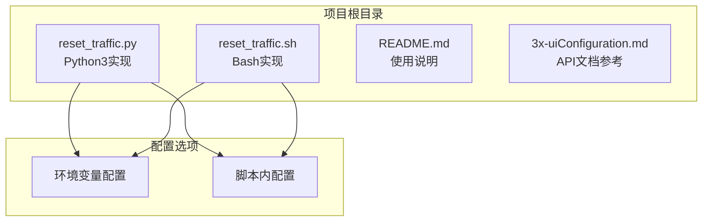
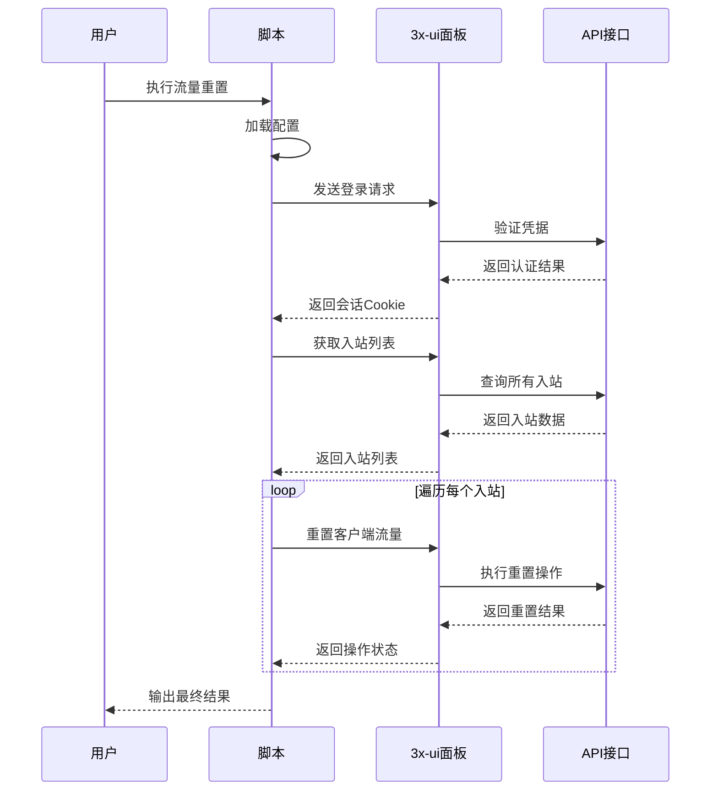
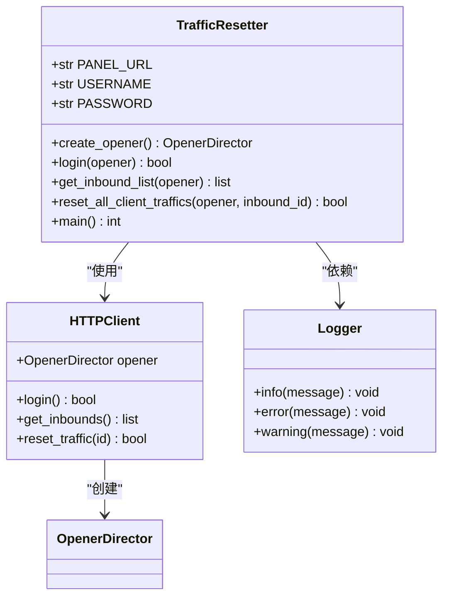
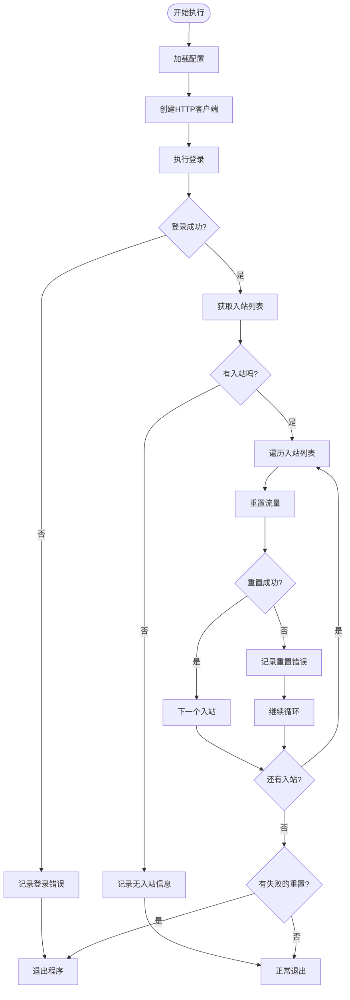
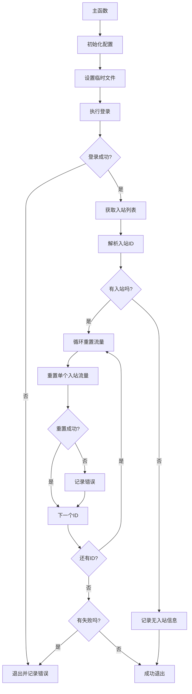
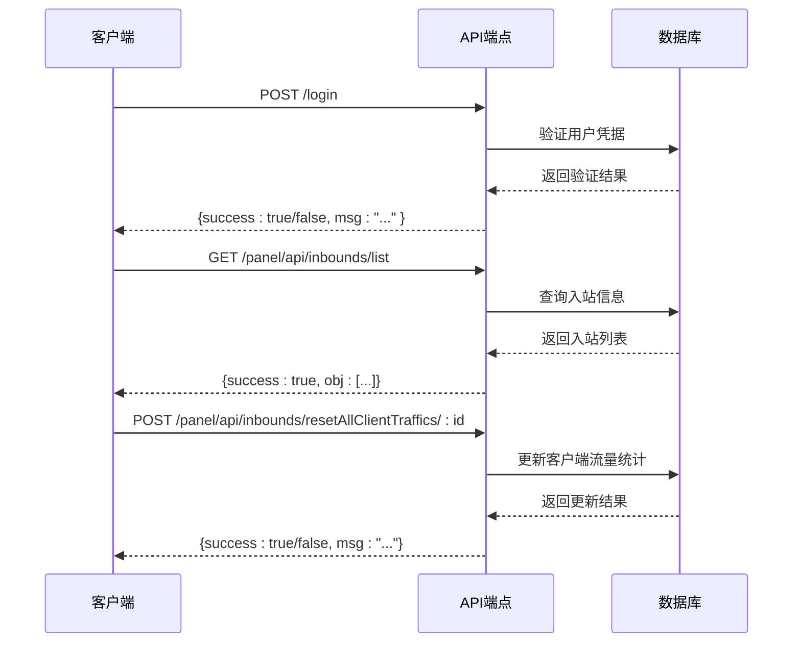
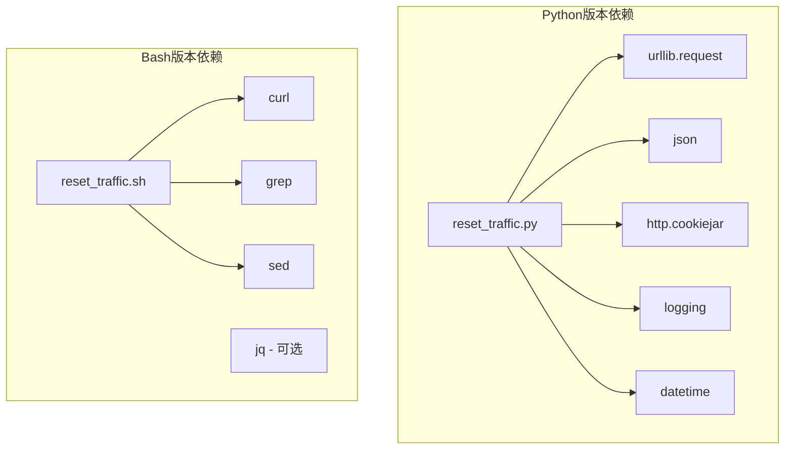

# 项目概述

<cite>
**本文档引用的文件**
- [README.md](file://README.md)
- [3x-uiConfiguration.md](file://3x-uiConfiguration.md)
- [reset_traffic.py](file://reset_traffic.py)
- [reset_traffic.sh](file://reset_traffic.sh)
</cite>

## 目录
1. [简介](#简介)
2. [项目结构](#项目结构)
3. [核心组件](#核心组件)
4. [架构概览](#架构概览)
5. [详细组件分析](#详细组件分析)
6. [依赖关系分析](#依赖关系分析)
7. [性能考虑](#性能考虑)
8. [故障排除指南](#故障排除指南)
9. [结论](#结论)

## 简介

3x-ui流量重置工具是一个专为3x-ui面板设计的自动化脚本工具，旨在通过调用3x-ui面板API自动重置所有入站客户端的已用流量。该工具提供了Python3和Bash两种实现方式，支持通过环境变量或直接修改脚本配置，具有详细的日志输出功能，并且非常适合配合cron定时任务执行。

### 主要功能特性

- **双语言实现**：同时提供Python3和Bash版本，满足不同环境需求
- **灵活配置**：支持环境变量配置和脚本内配置两种方式
- **自动认证**：自动登录并管理会话状态
- **批量处理**：遍历所有入站，批量重置客户端流量
- **详细日志**：提供完整的操作日志记录
- **定时执行**：完美支持cron定时任务

### 应用场景

- **月度流量重置**：每月1号自动重置所有用户的流量使用情况
- **自动化运维**：减少人工干预，提高运维效率
- **批量管理**：快速重置大量入站下的客户端流量
- **系统维护**：在系统维护期间重置用户流量使用

## 项目结构

该项目采用简洁的单文件架构，包含一个核心工具和相关文档：



**图表来源**
- [reset_traffic.py:1-139](file://reset_traffic.py#L1-L139)
- [reset_traffic.sh:1-116](file://reset_traffic.sh#L1-L116)
- [README.md:16-23](file://README.md#L16-L23)

**章节来源**
- [README.md:16-23](file://README.md#L16-L23)
- [reset_traffic.py:1-139](file://reset_traffic.py#L1-L139)
- [reset_traffic.sh:1-116](file://reset_traffic.sh#L1-L116)

## 核心组件

### 3x-ui面板基础概念

3x-ui是一个基于Xray核心的多协议多用户面板，支持多种传输协议包括VMess、VLESS、Trojan、Shadowsocks、Wireguard等。面板的核心组件包括：

- **入站(Inbound)**：接收连接的入口点，每个入站对应一种传输协议
- **客户端(Client)**：使用服务的终端用户，每个客户端有独立的流量统计
- **流量统计**：记录每个客户端的上传和下载使用量
- **会话管理**：通过登录认证获取访问权限

### 工具设计理念

该工具遵循最小化原则，通过直接调用3x-ui提供的RESTful API实现流量重置功能，避免了复杂的中间层抽象，确保了稳定性和可靠性。

**章节来源**
- [3x-uiConfiguration.md:147-202](file://3x-uiConfiguration.md#L147-L202)
- [README.md:5-14](file://README.md#L5-L14)

## 架构概览

工具采用分层架构设计，从上到下分为配置层、业务逻辑层和API交互层：

```mermaid
graph TB
subgraph "配置层"
A[环境变量配置]
B[脚本参数配置]
end
subgraph "业务逻辑层"
C[登录认证模块]
D[入站列表获取]
E[流量重置执行]
F[日志记录模块]
end
subgraph "API交互层"
G[3x-ui面板API]
H[/login]
I[/panel/api/inbounds/list]
J[/panel/api/inbounds/resetAllClientTraffics/:id]
end
subgraph "外部依赖"
K[Python标准库]
L[curl命令]
M[HTTP Cookie管理]
end
A --> C
B --> C
C --> H
C --> G
D --> I
E --> J
F --> G
K --> C
L --> C
M --> C
```

**图表来源**
- [reset_traffic.py:24-28](file://reset_traffic.py#L24-L28)
- [reset_traffic.sh:14-18](file://reset_traffic.sh#L14-L18)
- [reset_traffic.py:44-64](file://reset_traffic.py#L44-L64)
- [reset_traffic.py:67-82](file://reset_traffic.py#L67-L82)
- [reset_traffic.py:85-98](file://reset_traffic.py#L85-L98)

### 数据流架构



**图表来源**
- [reset_traffic.py:101-134](file://reset_traffic.py#L101-L134)
- [reset_traffic.sh:27-115](file://reset_traffic.sh#L27-L115)

## 详细组件分析

### Python版本实现分析

Python版本实现了完整的面向对象设计，使用标准库进行HTTP通信和JSON处理：

#### 核心类和函数结构



**图表来源**
- [reset_traffic.py:38-42](file://reset_traffic.py#L38-L42)
- [reset_traffic.py:44-64](file://reset_traffic.py#L44-L64)
- [reset_traffic.py:67-82](file://reset_traffic.py#L67-L82)
- [reset_traffic.py:85-98](file://reset_traffic.py#L85-L98)

#### 配置管理机制

Python版本采用环境变量优先的配置策略：

| 配置项 | 默认值 | 环境变量 | 用途 |
|--------|--------|----------|------|
| PANEL_URL | http://127.0.0.1:2053 | XUI_PANEL_URL | 面板访问地址 |
| USERNAME | admin | XUI_USERNAME | 登录用户名 |
| PASSWORD | admin | XUI_PASSWORD | 登录密码 |

#### 错误处理流程



**图表来源**
- [reset_traffic.py:101-134](file://reset_traffic.py#L101-L134)
- [reset_traffic.py:120-131](file://reset_traffic.py#L120-L131)

**章节来源**
- [reset_traffic.py:1-139](file://reset_traffic.py#L1-L139)

### Bash版本实现分析

Bash版本采用简洁的函数式编程风格，充分利用shell的字符串处理能力：

#### 核心函数结构



**图表来源**
- [reset_traffic.sh:27-115](file://reset_traffic.sh#L27-L115)

#### Shell脚本优势

- **轻量级**：无需额外依赖，仅需系统自带的bash和curl
- **可读性强**：逻辑清晰，易于理解和维护
- **错误处理**：完善的HTTP状态码检查和错误消息提取
- **资源管理**：自动清理临时cookie文件

**章节来源**
- [reset_traffic.sh:1-116](file://reset_traffic.sh#L1-L116)

### API交互机制

工具通过调用3x-ui面板提供的RESTful API实现功能：

#### 核心API端点

| 端点 | 方法 | 描述 | 参数 |
|------|------|------|------|
| `/login` | POST | 用户登录认证 | username, password |
| `/panel/api/inbounds/list` | GET | 获取所有入站列表 | 无 |
| `/panel/api/inbounds/resetAllClientTraffics/:id` | POST | 重置指定入站流量 | :id (入站ID) |

#### 请求响应模式



**图表来源**
- [3x-uiConfiguration.md:151-202](file://3x-uiConfiguration.md#L151-L202)

**章节来源**
- [3x-uiConfiguration.md:147-202](file://3x-uiConfiguration.md#L147-L202)

## 依赖关系分析

### 内部依赖关系



**图表来源**
- [reset_traffic.py:14-22](file://reset_traffic.py#L14-L22)
- [reset_traffic.sh:1-116](file://reset_traffic.sh#L1-L116)

### 外部依赖分析

| 组件 | 依赖类型 | 版本要求 | 用途 |
|------|----------|----------|------|
| Python版本 | 标准库 | Python 3.6+ | HTTP通信、JSON处理、日志记录 |
| Bash版本 | 系统工具 | Bash 4.0+, curl | 网络请求、文本处理 |
| 3x-ui面板 | 远程服务 | 任意版本 | API调用目标 |

**章节来源**
- [README.md:91-94](file://README.md#L91-L94)

## 性能考虑

### 时间复杂度分析

- **登录阶段**：O(1) - 单次HTTP请求
- **入站列表获取**：O(n) - n为入站数量
- **流量重置**：O(n) - 对每个入站执行一次重置操作
- **总体复杂度**：O(n)

### 内存使用优化

- **Python版本**：使用生成器和迭代器，避免一次性加载大量数据
- **Bash版本**：逐个处理入站ID，内存占用恒定
- **网络请求**：超时设置合理，避免长时间阻塞

### 并发处理

当前实现采用串行处理方式，确保：
- 避免API限流问题
- 简化错误处理逻辑
- 保证操作的原子性

## 故障排除指南

### 常见问题及解决方案

#### 1. 登录失败

**症状**：显示"登录失败"错误信息

**可能原因**：
- 凭据错误
- 面板地址配置错误
- 网络连接问题

**解决步骤**：
1. 验证3x-ui面板URL是否正确
2. 检查用户名和密码是否正确
3. 确认网络连通性
4. 查看详细错误日志

#### 2. API调用失败

**症状**：HTTP状态码非200

**可能原因**：
- 面板API不可用
- 会话过期
- 权限不足

**解决步骤**：
1. 检查3x-ui面板状态
2. 重新执行登录流程
3. 验证用户权限
4. 查看API响应详情

#### 3. 入站列表为空

**症状**：显示"没有入站"提示

**可能原因**：
- 面板中没有配置入站
- 权限限制导致无法查看

**解决步骤**：
1. 登录3x-ui面板确认入站配置
2. 检查用户权限级别
3. 验证API访问权限

#### 4. Cron定时任务执行失败

**症状**：定时任务无法正常执行

**可能原因**：
- 环境变量未正确设置
- 路径配置错误
- 权限问题

**解决步骤**：
1. 在命令行手动测试脚本
2. 检查crontab中的路径配置
3. 验证环境变量设置
4. 查看系统日志

### 调试技巧

#### 启用详细日志

```bash
# 设置详细日志级别
export XUI_DEBUG=true
python3 reset_traffic.py
```

#### 手动测试API

```bash
# 测试登录API
curl -X POST "http://localhost:2053/login" \
  -H "Content-Type: application/json" \
  -d '{"username":"admin","password":"your_password"}'

# 测试入站列表API
curl -X GET "http://localhost:2053/panel/api/inbounds/list"
```

**章节来源**
- [reset_traffic.py:104-105](file://reset_traffic.py#L104-L105)
- [reset_traffic.sh:41-51](file://reset_traffic.sh#L41-L51)

## 结论

3x-ui流量重置工具是一个设计精良、实现简洁的自动化脚本工具。它通过直接调用3x-ui面板API实现了流量重置的核心功能，提供了Python3和Bash两种实现方式以适应不同的使用场景。

### 主要优势

1. **简单可靠**：直接调用官方API，减少中间层复杂性
2. **跨平台支持**：同时支持Python和Bash环境
3. **配置灵活**：支持环境变量和脚本配置两种方式
4. **易于维护**：代码结构清晰，便于理解和修改
5. **生产就绪**：完善的错误处理和日志记录机制

### 技术特色

- **双语言实现**：满足不同技术栈的需求
- **环境变量配置**：便于容器化部署和CI/CD集成
- **详细日志输出**：便于问题诊断和审计
- **定时任务友好**：完美支持cron定时执行

### 适用场景

该工具特别适用于需要定期重置用户流量使用量的场景，如：
- 月租制服务的流量重置
- 企业内部VPN的流量管理
- 学校或公司的网络服务管理
- 云服务提供商的计费周期重置

通过合理的配置和部署，这个工具可以显著提高运维效率，减少人工干预，为企业提供可靠的自动化流量管理解决方案。